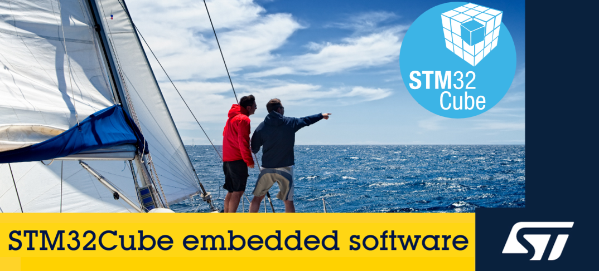

# STM32Cube U5 HAL2 drivers Preview - Explore, Experiment, and Share Your Feedback

    <a href="./CONTRIBUTING.md/">Contributing Guide</a> |
    <a href="./examples/">Examples</a> |
    <a href="./docs/">Documentation</a>

> [!IMPORTANT]
> This is a **preview** of the upcoming STM32Cube HAL2 Drivers for STM32U5, with the purpose of enabling the STM32 community to **give feedback**.
> It is intended for **evaluation** and **experimentation**, as it may undergo changes.

----

## Table of contents

- [Overview](#overview)
- [Getting started](#getting-started)
- [What is coming with STM32Cube HAL2?](#what-is-coming-with-stm32cube-hal2)
  - [STM32Cube HAL2](#stm32cube-hal2)
  - [Other changes](#other-changes)
    - [Examples](#examples)
    - [Documentation](#documentation)
    - [Device Family Pack (DFP)](#device-family-pack-dfp)
    - [Part drivers](#part-drivers)
- [Contributing](#contributing)

## Overview

The STM32Cube HAL drivers are part of the STM32Cube ecosystem, aimed at delivering a comprehensive set of software and hardware that supports and optimizes the development of applications on STM32 microcontrollers.

They are designed to provide a high-level API for accessing the hardware features of any given STM32 microcontroller, with a focus on portability, ease of use, and reuse to assist developers in creating applications faster and more efficiently. They cover the entire STM32 portfolio and all the features of the STM32 microcontrollers.

## Getting started

To get started with the STM32Cube HAL2 drivers and explore the new features and improvements, the [examples section](./examples/) provides a template along with a set of examples demonstrating the usage of the STM32Cube HAL2 drivers. These examples supports CMake and the Visual Studio Code IDE, utilizing the [STM32Cube for Visual Studio Code](https://marketplace.visualstudio.com/items?itemName=stmicroelectronics.stm32-vscode-extension&ssr=false#review-details) extension or IAR Embedded Workbench for ARM.

## What is coming with STM32Cube HAL2?

### STM32Cube HAL2

The STM32Cube HAL2 is an upcoming **major update** to the STM32Cube HAL drivers.
The aim is to improve the daily workflow of developers by enhancing the API both in terms of **usability** and **performance**, while preserving the fundamental principles of the STM32Cube HAL drivers.

It is designed to be more efficient, user-friendly, and portable across the STM32 portfolio, with enhanced integration with RTOSes and improved compliance with C standards.
More details can be found in the [stm32u5xx_drivers](./stm32u5xx_drivers), which provides an overview some of the key changes to support the improvements.

### Other changes

To support the update of the STM32 HAL drivers to HAL2, several other components of the STM32Cube Embedded software are also being updated.

#### Examples

We are updating the examples to utilize the new HAL2 API. In addition to this, other enhancements are being made to the examples which can be found in the [examples section](./examples/) of this repository.

#### Documentation

The documentation supporting HAL2 will be available through a new online documentation platform, offering an intuitive browsing experience to help developers quickly find the information they need. More information about the documentation can be found in the [Documentation section](./docs/README.md).

#### Device Family Pack (DFP)

The DFP provides essential information and files for IDEs, toolchains, and software applications to support the STM32 devices. It includes the descriptor files, startup files, linker scripts, and other resources to support application development on a STM32.

#### Part drivers

> [!NOTE]
> The Part drivers replace the BSP (Board Support Package) Component drivers.

Part drivers are standalone drivers, that are designed to support external parts, while being abstracted from the microcontroller they are connected to. This allows developers to use them independently of the board they are working on. Additionally, an agnostic IO interface will be introduced for all supported buses, eliminating direct dependency on the core drivers.

## Contributing

To provide feedback or other reports, please refer to the [CONTRIBUTING.md](./CONTRIBUTING.md) guide.
