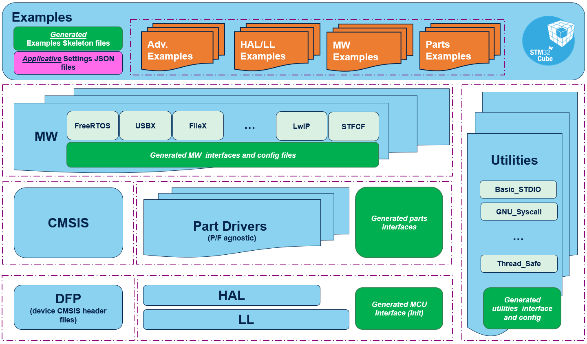

# Release Notes for **STM32Cube SW Package U5 v2.0.0**

Copyright © 2025 STMicroelectronics

  

---

## Purpose

**STM32Cube is an STMicroelectronics original initiative to ease developers life by reducing development efforts, time and cost.**

STM32Cube covers STM32 portfolio.

STM32Cube SW Package 2.x.y includes:

- A comprehensive STM32Cube embedded software platform, delivered per series (such as STM32CubeU5 for STM32U5 series)

  - The HAL2 Drivers, an STM32 abstraction layer embedded software, ensuring maximized portability across STM32 portfolio

  - A consistent set of middleware libraries such as FreeRTOS, USBX, FileX, OpenBootloader, USBPD, TF-M, STFCF, Network Library...

  - A full set of examples for each board provided for this STM32 series.

The STM32Cube embedded software solution offers a straightforward API with a modular architecture, making it simple to fine tune custom applications and scalable to fit most requirements.

The **drivers** provided within this package **support** the **STM32U535 / STM32U545 / STM32U575 / STM32U585 / STM32U595xx / STM32U5A5xx / STM32U599xx / STM32U5A9xx lines.**

Below links to the most useful documents:

- [HAL2 Overview](stm32u5xx_drivers/README.md): A high-level overview of the HAL2 drivers, their purpose, and key features.
- [HAL2 Drivers](https://dev.st.com/stm32cube-docs/stm32u5-hal2/2.0.0-beta.1.1/index.html): Detailed information about each HAL2 driver, including functionality, API, and usage.
- [STM32Cube Software Examples](https://dev.st.com/stm32cube-docs/examples/1.0.0-beta.1.0/index.html): A user manual for the STM32Cube HAL2 software examples, covering all aspects such as how to use the examples, their structure, and how to run them.
- [Breaking changes in concepts](./docs/breaking_concepts/breaking_concepts_toc.rst): An explanation of the breaking changes introduced in HAL2, their implications, and guidance on adapting existing code to the new API.

---

## Software Bill of Materials

Delivered SBOM in [CycloneDX v1.5 format](sbom_cdx.json)

---

## License scheme

[License scheme](LICENSE.md)

---

## Update history

### 2.0.0-beta.1.0 / Jun-2025

#### Main changes

- Beta release of STM32Cube_SW_Package_U5_2.0.0, it is intended for evaluation purpose only and we welcome your feedbacks.
- The release includes HAL2 Drivers, Part Drivers, Utilities and projects on STM32U5 boards.
- It focuses on HAL2 drivers, whose evolutions bring footprint and performance optimizations, as well as new APIs designed to improve the developer experience.
- It provides a set of examples with projects for IAR EWARM IDE and STM32Cube for VS Code IDE.

#### Contents

##### CMSIS Drivers

- Official CMSIS core from ARM.

##### Device Family Pack (DFP)

- CMSIS Device (headers, startups).
- Device Support (FlashLoaders, SVD, linker templates).
- Please Refer to the [DFP release notes](stm32u5xx_dfp/Release_Notes.html) for details.

##### HAL2 Drivers

- HAL and LL drivers source code Beta Release.
- Drivers that include HAL2 evolutions, please refer to [stm32u5xx_hal release notes](stm32u5xx_drivers/Release_Notes.md) for more details.

##### Part Drivers

- Led, button, tcpp01 drivers.

##### Utilities

- Basic_STDIO: provides simple logging capabilities used by some examples.
- Syscalls: implements the operating system interface documented by newlib.
- Sequencer: helps the task scheduling inside a system without OS.

##### Examples

- Examples demonstrating features on various boards.
- The examples are delivered in a preliminary format with support of EWARM and STM32Cube for VS Code.
- PRINTF has been disabled by default in most of the examples.

##### Miscellaneous

- Project extractor: extracts an example project from a SW package to a self-contained structure.

##### Documentation

- First delivery of browsable online documentation for HAL2 Drivers and Examples accessible from ST public server.
  - [HAL2 Drivers User Manual](https://dev.st.com/stm32cube-docs/stm32u5-hal2/2.0.0-beta.1.1/index.html)
  - [Examples User Manual](https://dev.st.com/stm32cube-docs/examples/1.0.0-beta.1.0/index.html)

---

## Known limitations

- As a beta release, this package has not been fully tested and may contain some bugs.
- Some HAL2 drivers are partially available or not available at all (see [stm32u5xx_hal release notes](stm32u5xx_drivers/Release_Notes.md) for more details).
- Some examples might encounter compilation or execution errors, as this is a beta release.
- IAR EWARM IDE can have some issues with too long paths. For proper operations, project extractor should be used.
- IAR examples projects have been developed with V9.20. Depending on the MCU, you may need to use a more recent version, see [IAR Release Notes](https://updates.iar.com/?product=EWARM).
- The HAL2 and examples will be compatible and configurable with the new version of STM32CubeMX, which will be available upon the official release of HAL2. Therefore, they are not configurable with the current STM32CubeMX version.

---

## Development toolchains and compilers

- IAR Embedded Workbench for ARM (EWARM) toolchain V9.60.3 + ST-LINK
- STM32Cube for VS Code 3.4.11 pre-release version (GCC13 compiler)

---

## Supported devices and boards

- [B-U585I-IOT02A Discovery](https://www.st.com/en/evaluation-tools/b-u585i-iot02a.html) board rev.C
- [NUCLEO-U545RE-Q Nucleo](https://www.st.com/en/evaluation-tools/nucleo-u545re-q.html) board rev.D
- [NUCLEO-U575ZI-Q Nucleo](https://www.st.com/en/evaluation-tools/nucleo-u575zi-q.html) board rev.C

---

## Backward compatibility

HAL2 brings major evolutions vs. HAL1 which leads to API breaks.

---

## Dependencies

NA

---

## Additional Information

For complete documentation on STM32 Microcontrollers, visit: [www.st.com/STM32](http://www.st.com/STM32)
