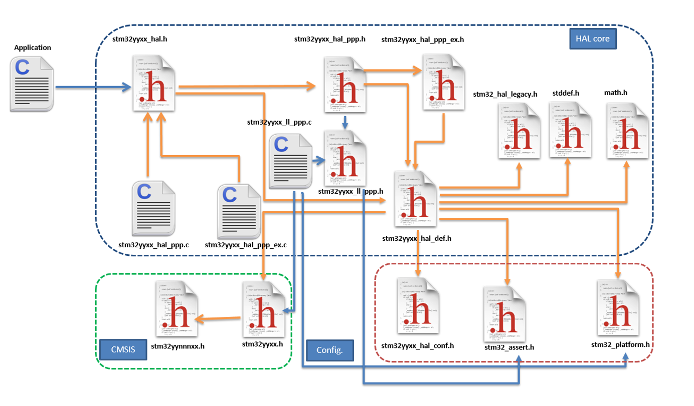
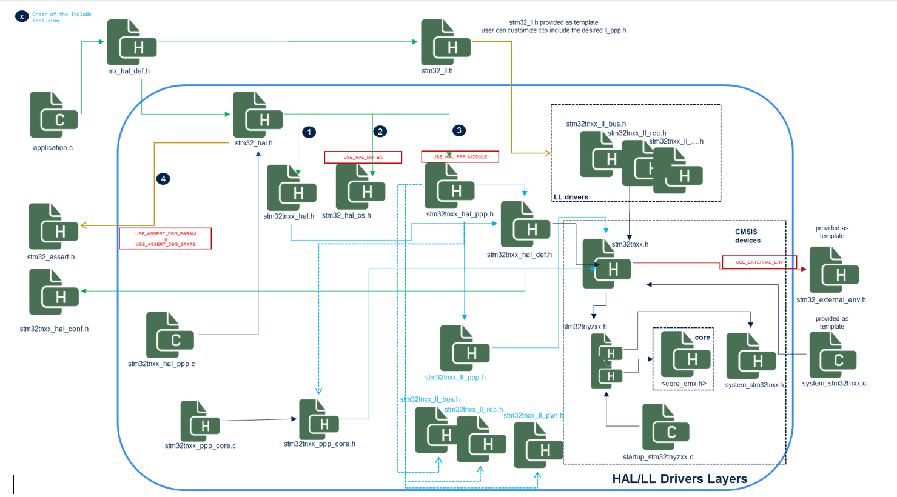

HAL refactoring 
***************

.. _breaking_concepts_concept_L1:

Add a central include HAL file: stm32_hal.h.
=============================================

.. list-table:: Differences Between HAL1 and HAL2
   :header-rows: 1

   * - Feature
     - HAL1
     - HAL2
   * - Entry Point Header File
     - ``stm32tnxx_hal.h`` serves as the unique application entry point header file to the HAL library. 
       It is the only header file that needs to be included by the application file, with
       ``tn`` in ``stm32tnxx_hal.h`` being the name of the series (e.g., ``stm32u5xx_hal.h``).
     - ``stm32_hal.h`` is the unique entry point header file for any application using the HAL,
       without the name of the series.
   * - Inclusion
     - The ``stm32tnxx_hal.h`` file includes the HAL configuration file ``stm32tnxx_hal_conf.h`` that includes
       all HAL PPP driver header files ``stm32tnxx_hal_ppp.h`` under their
       respective module enabling defines ``HAL_PPP_MODULE_ENABLED``.
     - The ``stm32_hal.h`` file includes the ``stm32tnxx_hal.h`` first then all HAL PPP modules ``stm32tnxx_hal_ppp.h``
       under their respective module enabling defines ``USE_HAL_PPP_MODULE``.
   * - Module Enabling Defines
     - The ``HAL_PPP_MODULE_ENABLED`` defines are to be set in the ``stm32tnxx_hal_conf.h`` file.
     - The ``USE_HAL_PPP_MODULE`` defines are to be set in the ``stm32tnxx_hal_conf.h`` file.

Rationale
---------

- **Series Agnosticism**: Removing the name of the series from the entry point header file to the HAL library allows
  making the HAL agnostic versus the series. Users do not need to edit their application source code to change the name of the series in the
  HAL entry point inclusion when moving from one series to another.
  The user will only need to change the path in the IDE project to move from one series to another.
- **Configuration Simplification**: The HAL configuration file ``stm32tnxx_hal_conf.h`` now contains only
  the defines allowing the configuration of the HAL, including the ``USE_HAL_PPP_MODULE`` defines to activate the
  given HAL PPP module.
  The inclusion of the HAL PPP modules ``stm32tnxx_hal_ppp.h`` is now done inside the ``stm32_hal.h``
  under the ``USE_HAL_PPP_MODULE`` conditional defines and no longer in the ``stm32tnxx_hal_conf.h``.

____

.. _breaking_concepts_concept_L2:

Add a central include HAL file: stm32_ll.h.
=============================================

In HAL2, a new header file is provided ``stm32_ll.h`` to serve as a single inclusion entry point to all the LL drivers header files of a given series.
The file name is series agnostic and it is provided as a template (to be copied by the user to his application).
In the case of standalone usage, the given ``stm32_ll.h`` template includes all the LL driver header files of the given series.
Users can utilize the copied file as is, where all LL drivers of the given STM32 family are included, or customize it to keep only the required LL driver's inclusion.

Example:

.. code-block:: c

   /*** @file    stm32_ll.h
   ...
   /* Define to prevent recursive inclusion -------------------------------------*/
   #ifndef STM32_LL_H
   #define STM32_LL_H

   #ifdef __cplusplus
   extern "C" {
   #endif

   /* Includes ------------------------------------------------------------------*/
   #include "stm32u5xx_ll_adc.h"
   #include "stm32u5xx_ll_bus.h"
   #include "stm32u5xx_ll_comp.h"
   #include "stm32u5xx_ll_cordic.h"
   #include "stm32u5xx_ll_crc.h"
   #include "stm32u5xx_ll_crs.h"
   #include "stm32u5xx_ll_dac.h"
   #include "stm32u5xx_ll_dcache.h"
   #include "stm32u5xx_ll_dma.h"
   #include "stm32u5xx_ll_dma2d.h"
   #include "stm32u5xx_ll_exti.h"
   #include "stm32u5xx_ll_fmac.h"
   #include "stm32u5xx_ll_gpio.h"
   #include "stm32u5xx_ll_gtzc.h"
   #include "stm32u5xx_ll_i2c.h"
   #include "stm32u5xx_ll_icache.h"
   #include "stm32u5xx_ll_iwdg.h"

   #endif /* STM32_LL_H */

____

.. _breaking_concepts_concept_L3:

Add platform file: stm32_external_env.h.
============================================

When using the HAL or/and LL drivers, several defines must be provided for adapting internal and
external oscillator values,as well as system configurations. These include:

- **Internal Oscillator Values**: Adaptations like HSI, MSI, etc.
- **External Oscillator Values**: Adaptations like HSE, LSE, etc.
- **System Configuration**: Values like VDD_VALUE.

In HAL1, these various defines are provided/customizable in the ``stm32tnxx_hal_conf.h`` file.
In HAL2, a new ``stm32_external_env.h`` file is provided as a template and contains the specific parameters related to
the platform, such as external oscillators. This file is included in ``stm32tnxx.h`` under the switch ``USE_EXTERNAL_ENV``.
The ``USE_EXTERNAL_ENV`` define, when needed, shall be set in the project pre-processor.

To streamline the configuration, all internal oscillator values are now placed in the CMSIS device file such as
``stm32u575xx.h``. In HAL2, the ``stm32tnxx_hal_conf.h`` contains only the configuration defines used by HAL.

.. note::

   As we moved internal oscillator values inside the CMSIS device file and external ones to ``stm32_external_env.h``,
   these defines are removed from HAL and LL files such as ``stm32tnxx_ll_rcc.h``. The HAL and LL RCC still use these oscillator values, but they are defined in the CMSIS device files or in ``stm32_external_env.h``. This reorganization ensures a cleaner separation of STM32 device-specific parameters, platform (boards) specific parameters, and HAL-specific configuration, improving maintainability and clarity.

.. important::

   The ``stm32_external_env.h`` is not part of the HAL pack; it is rather provided as a template in the DFP pack.
   It shall then be copied once to the user example or application and updated as per the platform specifications.
   
____

.. _breaking_concepts_concept_L4:

Refactor the HAL inclusion model.
==================================

The HAL1 and HAL2 inclusion models for STM32 microcontrollers differ primarily in their structure and inclusion mechanisms.
HAL1 uses ``stm32tnxx_hal.h`` as the entry point, enabling PPP modules through the configuration
file ``stm32tnxx_hal_conf.h`` under their respective ``HAL_PPP_MODULE_ENABLED`` defines set in
the same ``stm32tnxx_hal_conf.h`` file.

In contrast, HAL2 uses ``stm32_hal.h`` as the entry point, with a more structured inclusion order and additional
conditional flags (``USE_HAL_MUTEX``, ``USE_ASSERT_DBG_PARAM``, ``USE_ASSERT_DBG_STATE``, ``USE_HAL_PPP_MODULE``)
to include specific files like ``stm32_hal_os.h``, ``stm32_assert.h``, and the various ``stm32tnxx_hal_ppp.h`` modules.
The activation of the conditional defines ``USE_HAL_MUTEX`` and ``USE_HAL_PPP_MODULE`` is done through
the configuration file ``stm32tnxx_hal_conf.h``. The activation of the defines ``USE_ASSERT_DBG_PARAM``
and ``USE_ASSERT_DBG_STATE`` shall be done, if needed, in the IDE pre-processor settings.

In HAL2, user configuration is propagated through ``stm32tnxx_hal_def.h`` that includes ``stm32tnxx_hal_conf.h``.

In HAL2, the ``stm32tnxx_ll_ppp.c`` files have been removed, and users shall resort to an equivalent sequence
of LL static inline functions provided within ``stm32tnxx_ll_ppp.h`` to perform the equivalent
of ``LL_PPP_Init`` and ``LL_PPP_DeInit``.

In HAL2, the ``stm32tnxx_hal_ppp_ex.h`` modules have been removed, and  the equivalent of their content APIs merged inside
the corresponding ``stm32tnxx_hal_ppp.h``.

Both HAL1 and HAL2 provide ``stm32_assert.h`` as a customizable template.
HAL2 provides additional template files such as ``stm32_ll.h`` and utilizes an additional ``stm32_external_env.h``
template file that is provided by the DFP.

HAL1 Inclusion Model
----------------------

HAL2 Inclusion Model
----------------------

____

.. _breaking_concepts_concept_L5:

Remove the global Msp file.
============================

In HAL1, the functions ``HAL_MspInit`` and ``HAL_MspDeInit`` are respectively called from ``HAL_Init`` and ``HAL_DeInit``.
These functions are provided as weak callbacks to be implemented by the user to perform system-level
initializations (Clock, GPIOs, interrupts).

Additionally, each HAL PPP driver provides dedicated ``HAL_PPP_MspInit`` and ``HAL_PPP_MspDeInit`` callbacks
that are respectively called from ``HAL_PPP_Init`` and ``HAL_PPP_DeInit``.
These functions are provided as weak callbacks to be implemented by the user to perform peripheral-level
initializations (Peripheral Clock, GPIOs, DMA, and interrupts).

The ``stm32tnxx_hal_msp_template.c`` file was provided as a template file to be copied to the user application
folder or generated by CubeMX.
It contains the implementation of the MSP initialization and de-initialization functions.

In HAL2, all the ``MspInit`` and ``MspDeInit`` functions are removed, including the global ones
and the PPP ones. The equivalent of the global MSP Init and DeInit are respectively expected
after the generated call to ``HAL_Init`` and ``HAL_DeInit`` (without using any callback).
The equivalent of the peripheral MSP Init and DeInit are respectively expected after
the generated call to ``HAL_PPP_Init`` and ``HAL_PPP_DeInit`` (without using a callback).
The file ``stm32tnxx_hal_msp_template.c`` is no longer used and has been removed.

  

____

.. _breaking_concepts_concept_L6:

Cleanup the HAL configuration file
===================================

In HAL2, The HAL configuration file ``stm32tnxx_hal_conf.h`` contains only the defines
allowing the configuration of the HAL drivers.

.. list-table:: Comparative Table for HAL1 and HAL2 Configuration Files
   :header-rows: 1

   * - Feature
     - HAL1
     - HAL2
   * - Enabling Defines for HAL PPP Modules
     - Various enabling defines for selected HAL PPP modules, e.g., ``HAL_ADC_MODULE_ENABLED``.
     - Various enabling defines for selected HAL PPP modules, e.g., ``USE_HAL_ADC_MODULE``..
   * - Oscillators and HW Configuration Defines
     - Defines related to oscillators and HW configuration, e.g., ``HSE_VALUE``, ``HSE_VALUE``
     - Internal oscillator and voltage values (e.g., ``HSI_VALUE``)
       moved inside the CMSIS device file ``stm32tnyzxx.h``.
       External ones (e.g., ``HSE_VALUE``) to ``stm32_external_env.h``.
   * - Tick Interrupt Priority
     - ``TICK_INT_PRIORITY``
     - ``USE_HAL_TICK_INT_PRIORITY``.
   * - Assert Selection
     - ``USE_FULL_ASSERT``
     - ``USE_FULL_ASSERT`` replaced by ``USE_ASSERT_DBG_PARAM``
       and ``USE_ASSERT_DBG_STATE``.
       These defines are no longer in the HAL configuration file.
       They are to be set in the IDE pre-processor settings if needed.
   * - HAL PPP Features Enabling Defines
     - e.g., ``USE_HAL_ADC_REGISTER_CALLBACKS``, ``USE_SPI_CRC``
     - e.g., ``USE_HAL_ADC_REGISTER_CALLBACKS``, ``USE_HAL_SPI_CRC``
   * - HAL PPP Modules Inclusion
     - Example:

       .. code-block:: c

          #ifdef HAL_ADC_MODULE_ENABLED
          #include "stm32u5xx_hal_adc.h"
          #endif /* HAL_ADC_MODULE_ENABLED */

     - ``stm32tnxx_hal_ppp.h`` inclusion done inside ``stm32_hal.h``.
       under the ``USE_HAL_PPP_MODULE`` conditional defines. no longer in the ``stm32tnxx_hal_conf.h``.

   * - Assert Macro
     - Example:

       .. code-block:: c

          #ifdef USE_FULL_ASSERT

          #define assert_param(expr) (..)

          void assert_failed(uint8_t *file, uint32_t line);

          #else

          #define assert_param(expr) ((void)0U)

          #endif /* USE_FULL_ASSERT */

     - The assert macros are available in the ``stm32_assert.h`` as follows:

       .. code-block:: c

          #if defined(USE_ASSERT_DBG_PARAM)

          #define ASSERT_DBG_PARAM(expr) (..)

          void assert_dbg_param_failed(uint8_t *file, uint32_t line);

          #else

          #define ASSERT_DBG_PARAM(expr) ((void)0U)

          #endif /* USE_ASSERT_DBG_PARAM */

          #if defined(USE_ASSERT_DBG_STATE)

          #define ASSERT_DBG_STATE(__STATE__,__VAL__) (..)

          void assert_dbg_state_failed(uint8_t *file, uint32_t line);

          #else

          #define ASSERT_DBG_STATE(__STATE__,__VAL__) ((void)0U)
          #endif /* USE_ASSERT_DBG_STATE */

   * - Vital Parameter Run-Time Check
     - None
     - ``USE_HAL_CHECK_PARAM`` and ``USE_HAL_SECURE_CHECK_PARAM``: Enables or disables runtime parameter checks.

____

.. _breaking_concepts_concept_L7:

Merge HAL extension files with common ones and remove the EX prefix from APIs.
===============================================================================

In HAL2, the ``stm32tnxx_hal_ppp_ex.h`` modules have been removed, and the equivalent of their
content APIs merged inside the corresponding ``stm32tnxx_hal_ppp.h``.

Example:

.. list-table:: 
   :header-rows: 1

   * - HAL Version
     - File
     - API
   * - HAL1
     - ``stm32u5xx_i2c_ex.h``
     - ``HAL_I2CEx_ConfigAnalogFilter(..)``
   * - HAL2
     - ``stm32u5xx_i2c.h``
     - ``HAL_I2C_EnableAnalogFilter(..)`` and ``HAL_I2C_DisableAnalogFilter(..)``

____

.. _breaking_concepts_concept_L8:

Rename LL core drivers to stm32_ppp_core.h/.c to avoid confusion with user LL drivers.
=======================================================================================

In HAL1, ``core drivers`` are designed to provide a common implementation of peripherals that are used by several HAL drivers.

Example: ``stm32tnxx_ll_usb.c`` is the core driver abstracting the access of the USB OTG peripheral for HAL PCD and HAL HCD drivers.

Core drivers are not made to be used by the user application directly. The user application shall resort to the required HAL driver that is on top of the given LL core driver.

In HAL2, to avoid confusion between user LL drivers and the core drivers, these latter driver files are renamed to ``stm32tnxx_ppp_core.c/h`` (i.e., removing the term LL).

Example: The ``stm32tnxx_ll_usart.h`` is a user LL driver and is not impacted by this change.

The below table gives the list of core drivers (impacted by this file renaming) and the correspondence between HAL1 and HAL2:

.. list-table::
   :header-rows: 1
   :widths: 20 20 30 30

   * - Peripheral
     - Used in HAL driver
     - HAL1 core driver file naming
     - HAL2 core driver file naming
   * - Delay Block
     - QSPI/OSPI/SD/MMC
     - ``stm32tnxx_ll_dlyb.c/.h``
     - ``stm32tnxx_dlyb_core.c/.h``
   * - FMC/FSMC
     - SRAM/SDRAM/NOR/NAND
     - ``stm32tnxx_ll_fmc.c/.h``\n``stm32tnxx_ll_fsmc.c/.h``
     - ``stm32tnxx_fmc_core.c/.h``\n``stm32tnxx_fsmc_core.c/.h``
   * - SDMMC
     - SD/MMC/SDIO
     - ``stm32tnxx_ll_sdmmc.c/.h``
     - ``stm32tnxx_sdmmc_core.c/.h``
   * - USB OTG
     - PCD/HCD
     - ``stm32tnxx_ll_usb.c/.h``
     - ``stm32tnxx_usb_core.c/.h``

____

.. _breaking_concepts_concept_L9:

Cleanup stm32tnxx_hal.c/h and move HAL module includes to stm32_hal.h
=======================================================================

As detailed in section :ref:`migration_example_intro`, in HAL1 the ``stm32_hal.h`` is the unique entry point header file for any application
using the HAL drivers. the ``stm32_hal.h`` includes the ``stm32tnxx_hal.h`` first, then all
HAL PPP modules ``stm32tnxx_hal_ppp.h`` under their respective module enabling defines ``USE_HAL_PPP_MODULE``.

In HAL2, the ``stm32tnxx_hal.c/h`` module is kept and cleaned as follows:

- The ``stm32tnxx_hal`` module is limited to the following services:
  
  - HAL Init and De-Init
  - Tick/Time base management
  - An API to retrieve the device unique ID
  - An API to retrieve the HAL version

  .. code-block:: c

     hal_status_t HAL_Init(void);
     void HAL_Delay(uint32_t Delay); 
     hal_status_t HAL_DeInit(void);
     hal_status_t HAL_InitTick(hal_tickFreq_t tick_freq, uint32_t tick_priority);
     uint32_t HAL_GetTick(void);
     uint32_t HAL_GetTickPrio(void);
     hal_tickFreq_t HAL_GetTickFreq(void);
     void HAL_SuspendTick(void);
     void HAL_ResumeTick(void);
     uint32_t HAL_GetVersion(void);
     hal_status_t HAL_GetDeviceUniqueID(hal_device_uid_t *uid);

- The specific STM32 device services APIs such as DBGMCU, SYSCFG, VREFBUF, and EXTI are no longer provided within the ``stm32tnxx_hal`` module. Instead, they are offered by the following modules:
  
  - The APIs related to the DBGMCU are provided by the HAL module: ``stm32tnxx_hal_dbgmcu.h/.c``
  - The APIs related to the SBS are provided by the HAL module: ``stm32tnxx_hal_sbs.h/.c``
  - The APIs related to the SYSCFG are provided by the HAL module: ``stm32tnxx_hal_syscfg.h/.c``
  - The APIs related to the VREFBUF are provided by the HAL module: ``stm32tnxx_hal_vrefbuf.h/.c`` (note that the VREFBUF APIs are now prefixed by ``HAL_VREFBUF_XXX`` without the SYSCFG mention)
  - ART/PREFETCH APIs are available within the HAL flash module
  - EXTI APIs are provided by the ``HAL_EXTI`` driver.

____

.. _breaking_concepts_concept_L10:

Cleanup stm32tnxx_hal_def.h and redirect old defines to ARM recommended intrinsics like __WEAK and __PACKET. 
=============================================================================================================

The stm32tnxx_hal_def.h file provides essential configurations and definitions to the STM32 HAL. In HAL2, this file is reworked as follows:

.. list-table::
   :header-rows: 1

   * - **Aspect**
     - **HAL1**
     - **HAL2**
   * - Configuration Header
     - ``stm32u5xx_hal_conf.h`` included by ``stm32u5xx_hal.h``
     - ``stm32u5xx_hal_conf.h`` included by ``stm32u5xx_hal_def.h``
   * - Device Family Pack (DFP) Header
     - ``#include "stm32u5xx.h"``
     - ``#include "stm32u5xx.h"`` (no change)
   * - Legacy File Inclusion
     - ``#include "Legacy/stm32_hal_legacy.h"``\nThe legacy header file provides aliases for API naming changes from one HAL1 version to another HAL1 version.
     - This file does not exist anymore.\nIn HAL2, this strategy is dropped, and the ``deprecated`` keyword will be used in case of API naming changes while keeping both naming.
   * - Standard Headers
     - ``#include <stddef.h>``, ``#include <math.h>``
     - ``#include <stddef.h>``, ``#include <math.h>`` (no change)
   * - HAL Status Enumeration
     - HAL1 enumeration:
       
       .. code-block:: c
       
          typedef enum {
            HAL_OK       = 0x00,
            HAL_ERROR    = 0x01,
            HAL_BUSY     = 0x02,
            HAL_TIMEOUT  = 0x03
          } HAL_StatusTypeDef;
     - HAL2 enumeration is renamed, ``HAL_INVALID_PARAM`` added and values maximize the hamming distance:
       
       .. code-block:: c
       
          typedef enum {
            HAL_OK            = 0x00000000U,
            HAL_ERROR         = 0xFFFFFFFFU,
            HAL_BUSY          = 0x55555555U,
            HAL_INVALID_PARAM = 0xAAAAAAAAU,
            HAL_TIMEOUT       = 0x5A5A5A5AU
          } hal_status_t;
   * - Lock Mechanism
     - The enum ``HAL_LockTypeDef`` is removed.
     - In HAL2, the lock mechanism is replaced by ``HAL_PPP_AcquireBus`` and ``HAL_PPP_ReleaseBus`` APIs that use an RTOS semaphore object.
   * - Peripheral Clock Model
     - Not defined
     - New in HAL2, these defines are added to control the behavior of the ``HAL_PPP_Init`` functions regarding the PPP clock enabling. The HAL configuration define ``USE_HAL_ADC_CLK_ENABLE_MODEL`` is to be set to one of these three possibilities:
       
       .. code-block:: c

          #define HAL_CLK_ENABLE_NO                  0U /* No clock activation in PPP */
          #define HAL_CLK_ENABLE_PERIPH_ONLY         1U /* PERIPH Clock activation only */
          #define HAL_CLK_ENABLE_PERIPH_PWR_SYSTEM   2U /* PERIPH Clock activation including PWR and/or system */
   * - HAL Maximum Delay
     - ``#define HAL_MAX_DELAY 0xFFFFFFFFU``
     - ``#define HAL_MAX_DELAY 0xFFFFFFFFU`` (no change)
   * - State Update Macro
     - Simple state reset macros
     - New atomic state update macro for internal HAL PPP drivers implementations (``HAL_CHECK_UPDATE_STATE``)
   * - DMA Linking Macro
     - HAL1 using a generic macro:
       
       .. code-block:: c

          #define __HAL_LINKDMA(__HANDLE__, __PPP_DMA_FIELD__, __DMA_HANDLE__)
     - In HAL2, the generic macro is removed and replaced by various explicit HAL PPP Set DMA APIs provided in each HAL PPP driver to link a DMA handle to a HAL PPP handle. Example:
       
       .. code-block:: c

          hal_status_t HAL_I2C_SetTxDMA(hal_i2c_handle_t *hi2c, hal_dma_handle_t *hdma);
          hal_status_t HAL_I2C_SetRxDMA(hal_i2c_handle_t *hi2c, hal_dma_handle_t *hdma);
   * - Bit Manipulation Macros
     - HAL1 ``stm32tnxx_hal_def.h`` provides:
       
       .. code-block:: c

          #define HAL_IS_BIT_SET(REG, BIT)         (((REG) & (BIT)) == (BIT))
          #define HAL_IS_BIT_CLR(REG, BIT)         (((REG) & (BIT)) == 0U)
     - ``HAL_IS_BIT_SET`` and ``HAL_IS_BIT_CLR`` are moved to ``stm32u5xx.h`` file.
   * - UNUSED Macro
     - .. code-block:: c

          #define UNUSED(X) (void)X
     - renamed to ``STM32_UNUSED`` and moved to ``stm32u5xx.h``.
   * - Weak and Packed Attributes
     - Compiler-specific definitions
     - Redirected to CMSIS macros (``__weak``, ``__packed``)
   * - RAM Function Definition
     - Compiler-specific definitions for RAM functions
     - Unified definition with ``DEF_ARMCC_VERSION``

____

.. _breaking_concepts_concept_L11:

Rework the HAL time base to provide ready-to-use timebase patterns based on TIM, RTC ALARM, and RTC Wakeup.
=============================================================================================================

HAL time base services 
-----------------------

For both HAL1 and HAL2, the HAL time base management is built by default on the systick and based on the following HAL services
that are all defined as weak in the stm32tnxx_hal module, so user can override them to use his own time base.

.. list-table:: HAL Time Base Management
   :header-rows: 1

   * - HAL1
     - HAL2
   * - .. code-block:: c

            typedef enum
            {
              HAL_TICK_FREQ_10HZ         = 100U,
              HAL_TICK_FREQ_100HZ        = 10U,
              HAL_TICK_FREQ_1KHZ         = 1U,
              HAL_TICK_FREQ_DEFAULT      = HAL_TICK_FREQ_1KHZ
            } HAL_TickFreqTypeDef;

            /* HAL tick counter current value (unit: ms) */
            __IO uint32_t            uwTick;
            /* HAL tick interrupt current priority */
            uint32_t                 uwTickPrio;
            /* HAL tick current frequency */
            HAL_TickFreqTypeDef      uwTickFreq;

            __weak HAL_StatusTypeDef HAL_InitTick(uint32_t TickPriority);

            __weak void HAL_IncTick(void);

            __weak void HAL_Delay(uint32_t Delay);

            __weak uint32_t HAL_GetTick(void);

            uint32_t HAL_GetTickPrio(void);

            HAL_StatusTypeDef HAL_SetTickFreq(HAL_TickFreqTypeDef Freq);

            HAL_TickFreqTypeDef HAL_GetTickFreq(void);

            __weak void HAL_SuspendTick(void);

            __weak void HAL_ResumeTick(void);

     - .. code-block:: c

            typedef enum
            {
              HAL_TICK_FREQ_10HZ         = 100U,
              HAL_TICK_FREQ_100HZ        =  10U,
              HAL_TICK_FREQ_1KHZ         =   1U,
              HAL_TICK_FREQ_DEFAULT      = HAL_TICK_FREQ_1KHZ
            } hal_tick_freq_t;

            /* HAL tick counter current value (unit: ms) */
            volatile uint32_t        uwTick;
            /* HAL tick interrupt current priority */
            uint32_t                 uwTickPrio;
            /* HAL tick current frequency */
            hal_tick_freq_t          uwTickFreq;

            __WEAK hal_status_t HAL_InitTick(hal_tick_freq_t tick_freq,
                                             uint32_t tick_priority);

            __WEAK void HAL_IncTick(void);

            __WEAK void HAL_Delay(uint32_t delay_ms);

            __WEAK uint32_t HAL_GetTick(void);

            uint32_t HAL_GetTickPrio(void);

            /* in HAL2 use HAL_InitTick to change 
               the frequency and the priority */

            hal_tick_freq_t HAL_GetTickFreq(void);

            __WEAK void HAL_SuspendTick(void);

            __WEAK void HAL_ResumeTick(void);

HAL time base customization 
-----------------------------
In both HAL1 and HAL2, the HAL time base APIs are provided as ``__WEAK`` functions.
Users can override these functions to use a TIMER or an RTC as a time base. Both HAL1 and HAL2 provide templates allowing the use of an RTC or a Timer as a HAL time base. The relevant components are:

.. list-table:: HAL Time Base Templates
   :header-rows: 1

   * - HAL1
     - HAL2
   * - Files:
     - Files:
   * - .. code-block:: none

            stm32tnxx_hal_timebase_rtc_alarm_template.c
            stm32tnxx_hal_timebase_rtc_wakeup_template.c
            stm32tnxx_hal_timebase_tim_template.c

            ``tn`` in ``stm32tnxx`` refers to the series name, e.g., stm32u5xx

     - .. code-block:: none

            stm32_hal_timebase_rtc_alarm.c
            stm32_hal_timebase_rtc_wakeup.c
            stm32_hal_timebase_tim.c

            The series name is removed from the file names.

.. list-table:: HAL Time overloading
   :header-rows: 1

   * - HAL1
     - HAL2
   * - The overloaded ``HAL_InitTick`` contains both the TIM or RTC initialization sequence plus the starting sequence.

       Example:

       .. code-block:: c

            static TIM_HandleTypeDef TimHandle;

            HAL_StatusTypeDef HAL_InitTick(uint32_t TickPriority)
            {
              RCC_ClkInitTypeDef clkconfig;
              uint32_t uwTimclock;
              uint32_t uwAPB1Prescaler;
              uint32_t uwPrescalerValue;
              uint32_t pFLatency;
              HAL_StatusTypeDef Status;

              __HAL_RCC_TIM6_CLK_ENABLE();

              HAL_RCC_GetClockConfig(&clkconfig, &pFLatency);

              uwAPB1Prescaler = clkconfig.APB1CLKDivider;

              if (uwAPB1Prescaler == RCC_HCLK_DIV1)
              {
                  uwTimclock = HAL_RCC_GetPCLK1Freq();
              }
              else
              {
                  uwTimclock = 2UL * HAL_RCC_GetPCLK1Freq();
              }

              uwPrescalerValue = (uint32_t)((uwTimclock / 100000U) - 1U);

              TimHandle.Instance = TIM6;

              TimHandle.Init.Period = (100000U / 1000U) - 1U;
              TimHandle.Init.Prescaler = uwPrescalerValue;
              TimHandle.Init.ClockDivision = 0;
              TimHandle.Init.CounterMode = TIM_COUNTERMODE_UP;
              Status = HAL_TIM_Base_Init(&TimHandle);

              if (Status == HAL_OK)
              {

                Status = HAL_TIM_Base_Start_IT(&TimHandle);

                if (Status == HAL_OK)
                {
                  if (TickPriority < (1UL << __NVIC_PRIO_BITS))
                  {
                    HAL_NVIC_SetPriority(TIM6_IRQn, TickPriority, 0);

                    HAL_NVIC_EnableIRQ(TIM6_IRQn);

                    uwTickPrio = TickPriority;
                  }
                  else
                  {
                    Status = HAL_ERROR;
                  }
                }
              }

              return Status;
            }

     - In HAL2, the overloaded ``HAL_InitTick`` contains:
       - A call to a function ``mx_tim/rtc_timebase_config_tick`` that initializes the TIM or the RTC for a given frequency.
       - The required TIM or RTC ``start`` actions.
       Example:

       .. code-block:: c

            hal_tim_handle_t *htim_timebase = NULL;

            hal_status_t HAL_InitTick(hal_tick_freq_t tick_freq, uint32_t tick_priority)
            {
              hal_status_t status = HAL_ERROR;
              ASSERT_DBG_PARAM(IS_TICK_FREQ(tick_freq));
              ASSERT_DBG_PARAM(IS_TICK_PRIO(tick_priority));

              uwTickFreq = tick_freq;

              htim_timebase = mx_tim_timebase_config_tick(tick_freq);

              if (htim_timebase != HAL_OK)
              {
                if (tick_priority < (1UL << __NVIC_PRIO_BITS))
                {
                  HAL_CORTEX_NVIC_SetPriority(TIM_TIMEBASE_IRQN,
                                              (hal_cortex_nvic_preemp_priority_t)tick_priority,
                                              (hal_cortex_nvic_sub_priority_t)0U);

                  uwTickPrio = tick_priority;

                  HAL_TIM_Start_IT(hTIM);

                  status = HAL_OK;
                }
              }

             return status;
            }

.. list-table:: Usage
   :header-rows: 1

   * - HAL1
     - HAL2
   * - Files ``stm32tnxx_hal_timebase_rtc_alarm_template.c``, ``stm32tnxx_hal_timebase_rtc_wakeup_template.c`` and
       ``stm32tnxx_hal_timebase_tim_template.c`` are provided as templates by the HAL and must be copied to the user application and updated if needed.

     - Files ``stm32_hal_timebase_tim.c``, ``stm32_hal_timebase_rtc_alarm.c``, and ``stm32_hal_timebase_rtc_wakeup.c`` are provided as
       ready to use (to use as is, without the need to copy or modify them) in the HAL folder ``stm32tnxx\timebases``.

   * - The TIM or RTC initialization sequences are provided within the function ``HAL_InitTick``.
   
     - Dedicated TIM or RTC initialization functions ``mx_tim/rtc_timebase_config_tick`` are provided by files ``mx_timx.c/h`` and ``mx_rtc.c/h``.
       These are implemented by the user (in the user application) by copying the templates
       ``mx_timx.c/h`` and ``mx_rtc.c/h`` and updating them if needed.
       ``mx_timx.c/h`` and ``mx_rtc.c/h`` are provided as templates by HAL under ``stm32tnxx\templates\timebases``.
       note that ``x`` in ``mx_timx.c/h`` is the index of the TIM instance eg. ``mx_tim6.c/h`` 

.. _breaking_concepts_concept_L12:

Rework the reorganization of HAL/LL files.
==========================================
.. list-table:: HAL1 and HAL2 Drivers
   :widths: 25 75
   :header-rows: 1

   * - Category
     - Description
   * - HAL1
     - The folder organization is as follow:

       - Inc subfolder provides all the drivers header files for HAL, LL core drivers and templates.

       - Src subfolder provides all the drivers source files for HAL, LL and core drivers and templates.

       .. code-block:: none

          STM32CubeU5/
             Drivers/
             ├── CMSIS/
             │   ├── Core/
             │   ├── Device/
             │   │   └── ST/
             │   │       └── STM32U5xx/
             └── STM32U5xx_HAL_Driver/
                 ├── Inc/
                 └── Src/
   * - HAL2
     - The folder organization is as follow:

       - hal subfolder provides the HAL source and header files stm32tnxx_hal_ppp.c/.h. and the HAL core drivers (e.g., stm32tnxx_usb_core.c/.h, stm32tnxx_fmc_core.c/.h).

       - ll subfolder provides the STM32 LL drivers i.e., files stm32tnxx_ll_ppp.h. Note that the LL source files stm32tnxx_ll_ppp.c have been removed.

       - os_port subfolder provides a HAL OS abstraction layer. Services within this OSAL are limited to semaphore and mutex usage, intended to be used by the HAL but can also be used by any other layer that needs to abstract these services. The os_port supports 2 versions: one based on FreeRTOS, and one "no os" version based on bare metal.

       - templates subfolder contains the template source files that need to be copied and customized into the user application when using the HAL in standalone. For example, the HAL conf header file shall be copied and customized into the user application.

       - timebases subfolder provides the HAL time base implementation with 3 possible flavors: based on TIMER, based on RTC alarm, and based on RTC wakeup.

       - utils subfolder provides the HAL utilities modules, e.g., utils/i2c_timing/stm32_utils_i2c.c/.h allowing to calculate the I2C timing values needed by HAL_I2C_Init.

       .. code-block:: none

          STM32Cube_SW_Package_U5/
          ├── cmsis/
          ├── dfp/
          │   └── stm32u5xx/
          ├── hal/
          └── stm32u5xx/
              ├── hal/
              ├── ll/
              ├── os_port/
              ├── templates/
              ├── timebases/
              └── utils/

____

.. _breaking_concepts_concept_L13:

Remove stm32tnxx_ll_ppp.c files
=================================
The LL initialization functions provided within files ``stm32tnxx_ll_ppp.c`` in HAL1 are no longer available in HAL2.
In HAL2, all LL ``stm32tnxx_ll_ppp.c`` (C file) are removed and only the ``stm32tnxx_ll_ppp.h`` LL header files containing static inline functions are kept.
If users needs to initialize a given peripheral using the LL layer, they shall rely on code generation with the LL layer.
This generates the required sequence based on the LL static inline functions provided within the ``stm32tnxx_ll_ppp.h`` header (.h) files.
The given generated sequence provides better footprint optimization compared to the previous LL Init functions provided in ``stm32tnxx_ll_ppp.c``.

.. note::
    As we applied the concept :ref:`breaking_concepts_concept_E1`,
    the various HAL PPP Functions are implemented on top of the LL functions, including the various HAL configuration functions.
    Given so, the various required LL initialization and deinitialization sequences can also be obtained by looking at the HAL Functions implementations.

    Example:

    .. code-block:: c

        hal_status_t HAL_I2C_SetConfig(hal_i2c_handle_t *hi2c, const hal_i2c_config_t *p_config)
        {
            I2C_TypeDef *p_i2cx;

            ASSERT_DBG_PARAM((hi2c != NULL));
            ...
            ASSERT_DBG_STATE(hi2c->global_state, (uint32_t)HAL_I2C_STATE_INIT | \
                                                 (uint32_t)HAL_I2C_STATE_IDLE);

            p_i2cx = I2C_GET_INSTANCE(hi2c);

            LL_I2C_Disable(p_i2cx);

            /* Configure I2Cx Frequency range */
            LL_I2C_SetTiming(p_i2cx, p_config->timing);

            /* Disable I2Cx Own Address1 and clear I2Cx Own Address1 mode */
            LL_I2C_DisableOwnAddress1AndMode(p_i2cx);

            /* Configure I2Cx Own Address1 and ack own address1 mode */
            if (p_config->addressing_mode == HAL_I2C_ADDRESSING_7BIT)
            {
                LL_I2C_ConfigOwnAddress1(p_i2cx, p_config->own_address1, LL_I2C_OWNADDRESS1_7BIT);
            }
            else /* HAL_I2C_ADDRESSING_10BIT */
            {
                LL_I2C_ConfigOwnAddress1(p_i2cx, p_config->own_address1, LL_I2C_OWNADDRESS1_10BIT);
            }

            /* Configure I2Cx addressing master mode */
            LL_I2C_SetMasterAddressingMode(p_i2cx, (uint32_t)p_config->addressing_mode);

            /* Enable the I2Cx AUTOEND by default, and enable NACK (must be disabled only during slave process) */
            LL_I2C_WRITE_REG(p_i2cx, CR2, (LL_I2C_READ_REG(p_i2cx, CR2) | I2C_CR2_AUTOEND | I2C_CR2_NACK));

            LL_I2C_Enable(p_i2cx);

            hi2c->global_state = HAL_I2C_STATE_IDLE;

            return HAL_OK;
        }

 

