# Getting started with Cube Software Examples

## STM32Cube for Visual Studio Code extension

The examples projects in this preview delivery are intended to be used with the Visual Studio Code and the STM32Cube for Visual Studio Code extension
The extension can be found here [STM32Cube for Visual Studio Code](https://marketplace.visualstudio.com/items?itemName=stmicroelectronics.stm32-vscode-extension&ssr=false#review-details)

> [!NOTE]  
> The examples are compatible with version 3.0.0 and later of the STM32Cube for Visual Studio Code extension, currently in preview.

## Extracting Examples projects

With the new structure of our examples, a shift in the way examples is being used are introduced.
Interacting with examples directly through the projects in the repository is no longer the recommended way to go.
When working with examples through the repository, a new utility, called project_extractor, is introduced.
The purpose of the project_extractor, is to extract a selected example along with the required resources into a standalone project structure.

How to use the project_extractor utility can be found in the [project_extractor](./../project_extractor/README.md).

## Preparing the examples in STM32CubeIDE for VS Code

After extracting the example project, open the app folder in VS Code

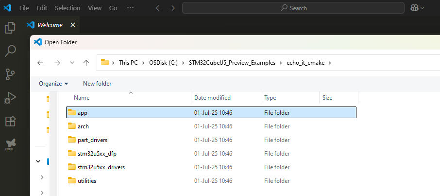

Go to STM32Cube VS Code extension through the STM32 icon in the left side panel

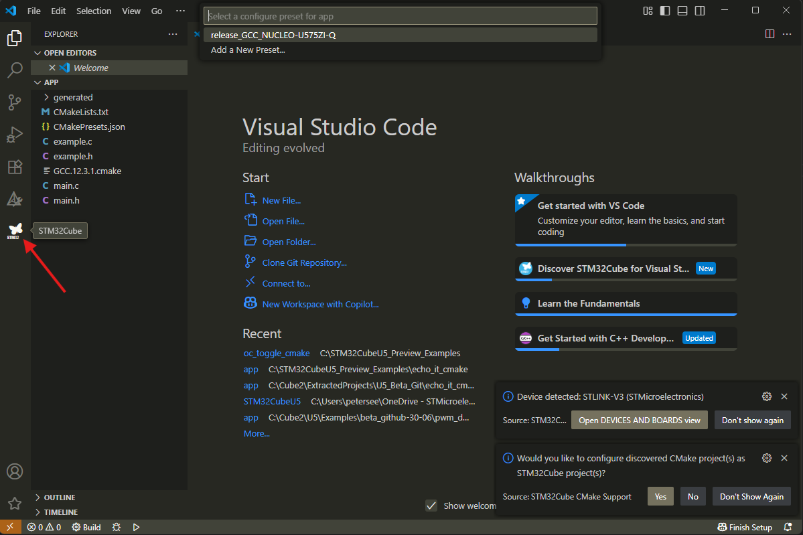

To set up the example in STM32Cube VS Code, click on the "Setup STM32Cube project(s)" button under STM32CUBE KEY ACTIONS

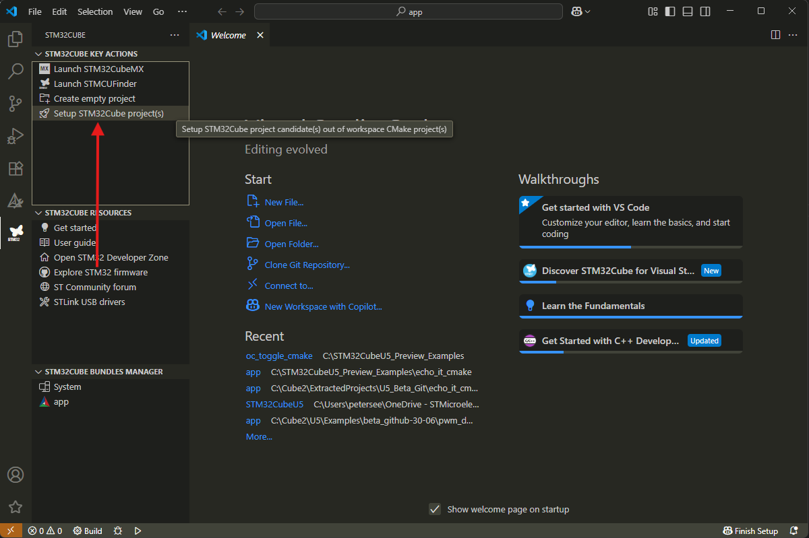

In the Board/Device selection dialog, search for U575 and select the NUCLEO-U575ZI-Q board

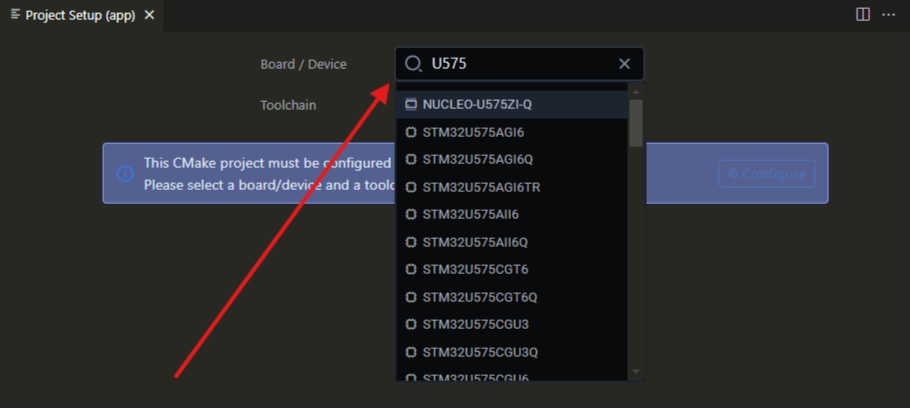

Leave GCC as the setting for Toolchain and click on the "Configure" button

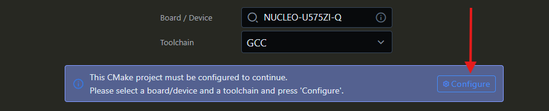

When profile options are presented, select the "release_GCC_NUCLEO_U575ZI_Q" profile

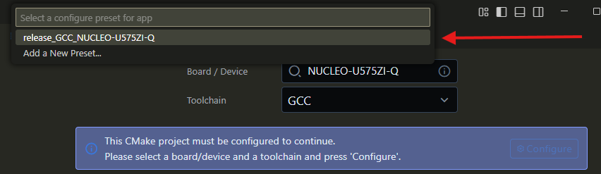

Let CMAKE prepare the project and when finished, press the save and close option that appears

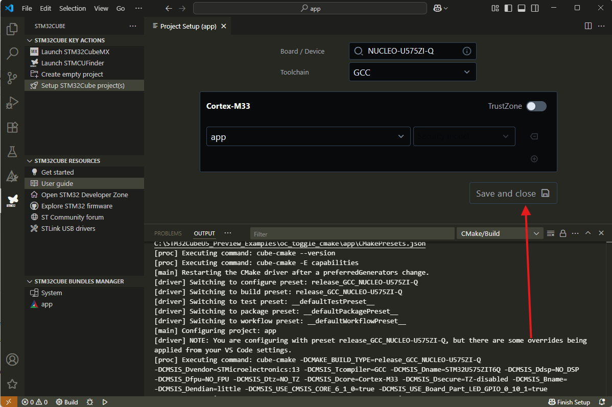

You should now be able to build the project by pressing the build button in the bottom bar of the VS Code window

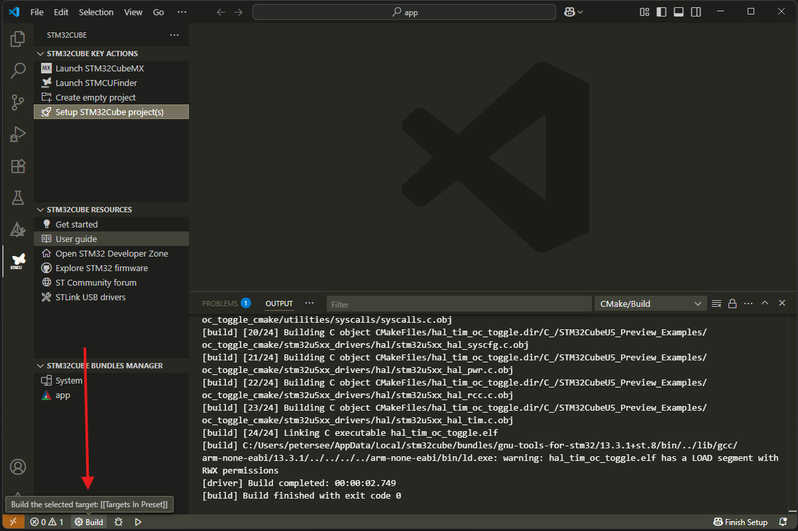

## Debugging the example

To improve the debugging experience and enable step-by-step debugging, the compiler flags need to be changed from "-Os" to "-O0 -g3".
This is done by editing the CMakeLists.txt file in the app folder.

Select the Explorer view in VS Code, and open the CMakeLists.txt file

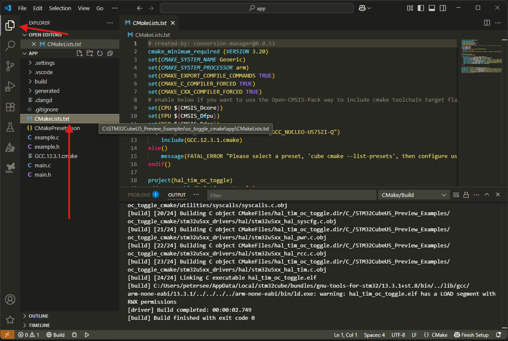

In the CMakeLists.txt file, find the line that starts with target_compile_options and contains "-Os" (Use control-F and search for "-Os", there can be multiple lines starting with target_compile_options)

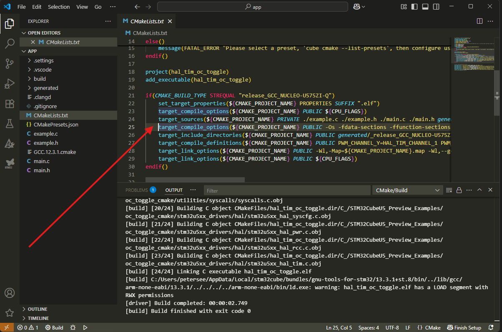

Change the "-Os" to "-O0 -g3"

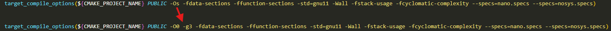

Save the CMakeLists.txt file, and then rebuild the project by pressing the Build button in the bottom bar of the VS Code window again.

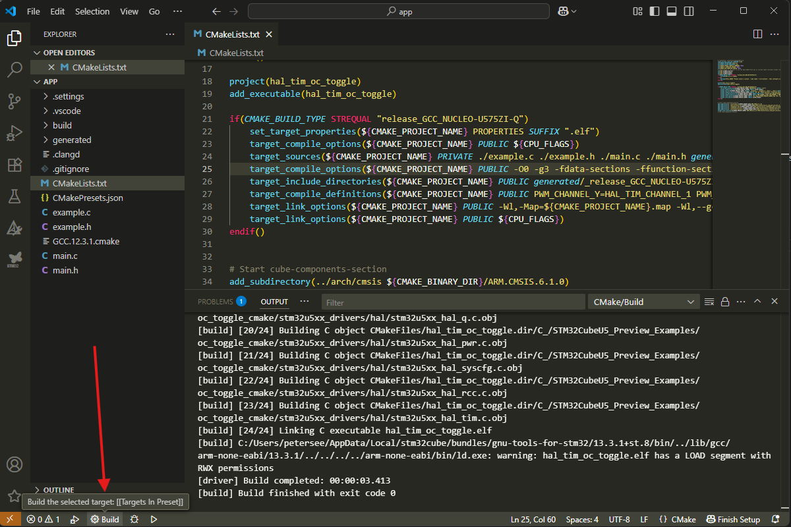

To start debugging, go to the Run and Debug view in VS Code by clicking on the Run and Debug icon in the left side panel.

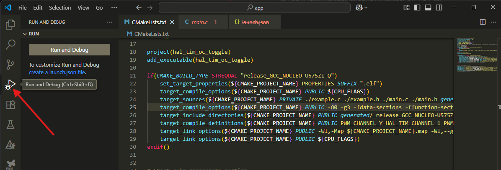

Then click on the "create a launch.json file" link to create a new launch configuration.

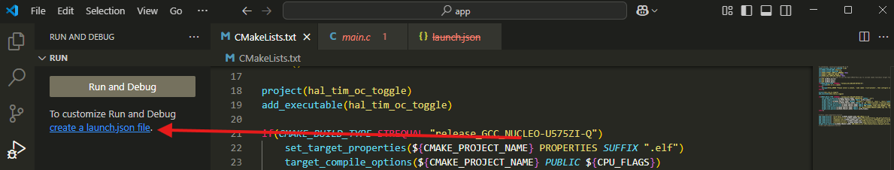

The "Select debugger" dialog will appear, select "STM32Cube: STLink GDB Server" from the list.

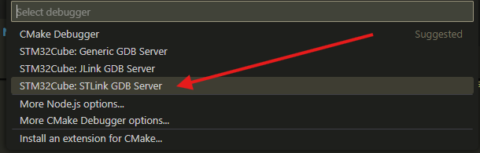

A new launch.json file will be created in the .vscode folder, and the configuration will be set up for debugging with the STLink GDB server.

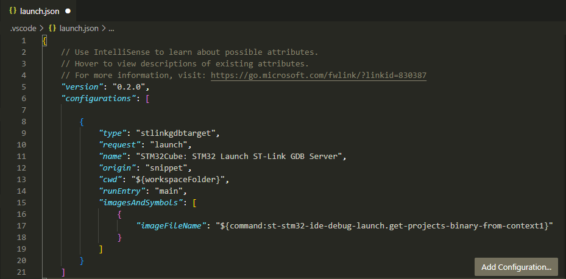

You should now be able to press "Start Debugging" to debug the example project step-by-step.

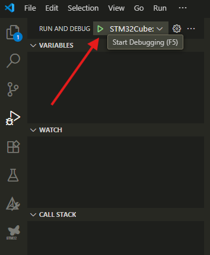

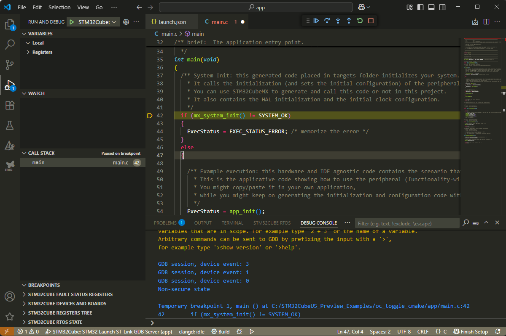
