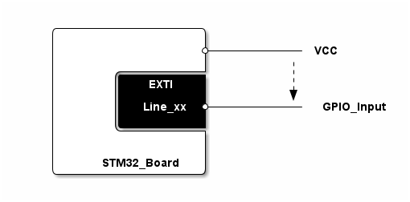

# __Example: *hal_gpio_exti*__

[](https://dev.st.com/stm32cube-docs/examples/latest/ "Online documentation.")

How to configure an interrupt on EXTI line with the HAL API.


## __1. Detailed scenario__

__Initialization phase__:
At the beginning of the `main()` function, the `mx_system_init()` function is called to initialize all the peripherals, the flash interface, the system clock, and the SysTick.
In the app_init() function, mx_example_exti_trigger_init() function is called to configure the EXTI Line.

The application executes the following __example steps__:

__Step 1__: configures the GPIO and the corresponding EXTI line.
    - sets the chosen GPIO in the correct input mode.
    - sets the corresponding EXTI line to the given GPIO port and requested trigger edge.
    - registers the user callback function to call when an EXTI interrupt happens.

__Step 2__: starts the EXTI line and waits for the interrupt.

__Step 3__: detects an EXTI interrupt.

__Step 4__: stops the EXTI Line, deinitializes the GPIO input, and terminates.

__End of example__:
The example is a one-shot application. It ends once the EXTI line is triggered.
You can verify that the example runs properly via the status LED and the `ExecStatus` variable.

If you enable `USE_TRACE`, you can follow these execution steps in the terminal logs:

```text
[INFO] Step 1: Device initialization COMPLETED.
[INFO] Step 2: Waiting for the configured EXTI interrupt.
[INFO] Step 3: Interrupt detected on EXTI.
[INFO] Step 4: Device deinitialization COMPLETED.
...
```


## __2. Example configuration__

[](https://dev.st.com/stm32cube-docs/examples/latest/#:~:text=config "An offline version is also available in the STM32Cube firmware package.")

This example demonstrates the following peripherals:

__GPIO and EXTI__:

It requires a GPIO input:

- With a pin connected to an EXTI line,
- With a way to toggle the GPIO pin voltage from 0V to MCU power supply (or MCU power supply to 0V) with a button, jumper, or transistor switch.


The GPIO input pin is configured as follows:

- Mode set at external interrupt mode with rising edge trigger detection.
- Internal pull-up resistors deactivated.
- Associated IRQ activated with a high priority.

> **_NOTE:_** for a given multiplexed EXTI line, only one of the connected GPIO pins of that EXTI multiplexer is active at a time.
In case of multiplexing, GPIO pins of the same order are grouped together and connected to an EXTI line: PA0, PB0 ... connected to the same EXTI line.
This means that you can configure an entire GPIO port as the source for EXTI lines.

> **__NOTE:__** be careful, some lines can share the same interrupt handler. On some platforms, the EXTI9_5_IRQn handler manages the EXTI lines 5 to 9.


## __3. Hardware environment and setup__

### __3.1. Generic Setup__

To use this example, you just need to connect a high level voltage on the GPIO input with:

- Either a simple button,
- Or a wire connected to a 3.3V power supply,
- Or an output from another MCU or any external component.

<!--
http://ditaa.sourceforge.net/#usage
plantUML ditaa integration supports PNG only
-->

<!--
@startditaa doc/example_hal_gpio_exti_setup.png
    /------------------\
    |                  |
    |                  *------------ VCC
    |                  |          |
    |       /----------+          :
    |       |   EXTI   |          |
    |       |          |          v
    |       |  Line_xx *------------ GPIO_Input
    |       |  cBLK    |
    |       \----------+
    |                  |
    |                  |
    |     STM32_Board  |
    \------------------/
@endditaa
-->



 ### __3.2. Specific board setups__

This section describes the exact hardware configurations of your project.

<details>
  <summary>On STM32U5 series.</summary>

  <details>
  <summary>On board B-U585I-IOT02A.</summary>

  | Board pin  | MCU pin | Signal name      | ARDUINO pin |
  | :---:      | :---:   | :---:            | :---:       |
  | CN13-6     | PE13    | MX_STATUS_LED     | D13         |
  | -          | PC13    | EXTI_TRIGGER_PIN | -           |

  </details>

  <details>
  <summary>On board NUCLEO-U575ZI-Q.</summary>

  | Board pin   | MCU pin | Signal name      | ARDUINO pin |
  | :---:       | :---:   | :---:            | :---:        |
  | CN12-19     | PC7     | MX_STATUS_LED     | -            |
  | CN11-23     | PC13    | EXTI_TRIGGER_PIN | -            |

  </details>


</details>

## __4. Troubleshooting__

[](https://dev.st.com/stm32cube-docs/examples/latest/#:~:text=Troubleshooting "An offline version is also available in the STM32Cube firmware package.")

Here are the points of attention for this specific example:

1. Using several GPIOs with EXTI interrupt:
  - The EXTI multiplexer groups pins from different ports to a global EXTI line.
      PA0, PB0,...PH0 are connected to the EXTI0 line.
      PA1, PB1,...PH1 are connected to the EXTI1 line.
      PAn, PBn,...PHn are connected to the EXTIn line.
    If you use several pins on the same EXTI line, you cannot detect from which port happened the interrupt.


## __5. See Also__

[](https://dev.st.com/stm32cube-docs/examples/latest/#:~:text=See%20Also "An offline version is also available in the STM32Cube firmware package.")

This [application note](https://www.st.com/content/ccc/resource/training/technical/product_training/group0/62/71/4f/2a/5d/25/4c/c7/STM32F7_System_EXTI/files/STM32F7_System_EXTI.pdf/jcr:content/translations/en.STM32F7_System_EXTI.pdf) gives information about the STM32 extended interrupts and events controller.

More information about the HAL flow can be found [here](https://wiki.st.com/stm32mcu/wiki/Getting_started_with_EXTI)

More information about the STM32Cube drivers can be found in the drivers' user manual of the STM32 series you are using.

For instance for the STM32U5 series: [User Manual](https://www.st.com/resource/en/user_manual/dm00813340-.pdf).

More information about the STM32 ecosystem can be found in the [STM32 MCU Developer Zone](https://www.st.com/content/st_com/en/stm32-mcu-developer-zone.html).


## __6. License__

Copyright (c) 2025 STMicroelectronics.

This software is licensed under terms that can be found in the LICENSE file in the root directory
of this software component.
If no LICENSE file comes with this software, it is provided AS-IS.
