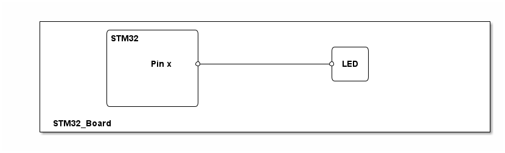

# __Example: *hal_gpio_toggle*__

How to configure and drive a GPIO through the HAL API. \
The best illustration is to use a GPIO connected to a led.

## __1. Detailed scenario__

__Initialization phase__: At the beginning of the `main()` function, the `mx_system_init()` function is called to initialize the peripherals, the flash interface, the system clock, and the SysTick.

The application executes the following __example steps__:

__Step 1__: configures the GPIO as a digital output because we are interested only in driving the GPIO HIGH and LOW states.

__Step 2__: infinite loop toggling the GPIO state with a 100ms delay.

__End of example__: the GPIO toggles forever.

## __2. Example configuration__

This example demonstrates the following peripheral:

- GPIO

It requires a GPIO pin supporting the following features:

- High Speed frequency
- Output push-pull mode

The GPIO pin is configured as follows:

- Mode set to output push-pull as this is the default GPIO output setting in most cases.
- No pull-up or pull-down required as the push-pull mode is selected.
- Speed set to very high frequency to have a good slew rate.

## __3. Hardware environment and setup__

### __3.1. Generic Setup__

<!--
@startuml
@startditaa{doc/generic_hardware_setup.png}
    +-------------------------------------------------------------------------+
    |          /--------------\                                               |
    |          |STM32         |                                               |
    |          |              |                     /-----\                   |
    |          |              |                     |     |                   |
    |          |      Pin x   *---------------------* LED |                   |
    |          |              |                     |     |                   |
    |          |              |                     \-----/                   |
    |          |              |                                               |
    |          |              |                                               |
    |          \--------------/                                               |
    |                                                                         |
    | STM32_Board                                                             |
    +-------------------------------------------------------------------------+
@endditaa
@enduml
-->

> **_NOTE:_**  This is a block diagram and not a schematic (resistors, transistors, exact links are not shown)
 as we focus on the role of the GPIO.

### __3.2. Specific board setups__

This section describes the exact hardware configurations of your project.

<!-- YOUR BOARDS ADDED HERE BY README GENERATION -->

  
On STM32U5 series.

  

  
On board B-U585I-IOT02A.

  | Board pin  | MCU pin | Signal name      | ARDUINO   connector pin |
  | :---:      | :---:   | :---:            | :---:       |
  | CN13-6     | PE13    | ARDUINO LED LD2  | D13         |
  

  

  
On board NUCLEO-U545RE-Q.

  | Board pin   | MCU pin | Signal name          | ARDUINO   connector pin |
  | :---:       | :---:   | :---:                | :---:        |
  | CN5-6       | PA5111  | User green LED (LD1) | -            |
  

  

  
On board NUCLEO-U575ZI-Q.

  | Board pin   | MCU pin | Signal name          | ARDUINO   connector pin |
  | :---:       | :---:   | :---:                | :---:        |
  | CN12-19     | PC7     | User green LED (LD1) | -            |
  

## __4. Troubleshooting__

Here are the points of attention for this specific example:

- Make sure that the GPIO port is clocked properly.
- If you use the GPIO to blink a led, do not use a too high rate that the eye cannot detect because of persistence of vision.
- If you use a GPIO to drive an external led, consider that a resistor may be needed to protect it.

## __5. See Also__

You can find pinout, pin description, and alternate functions in the datasheet of your chosen MCU. \
You can find the hardware layout and configuration of a board in its user manual. \
The connectors are described in this document, as well as the status LEDs and the buttons.

Example of documents available for STM32U585xx MCUs mounted on the discovery kit for IoT node board:

- See section 4 of [STM32U585xx](https://www.st.com/resource/en/datasheet/stm32u585ai.pdf).
- See section 7 of [Discovery kit for IoT node with STM32U5 Series](https://www.st.com/resource/en/user_manual/um2839-discovery-kit-for-iot-node-with-stm32u5-series-stmicroelectronics.pdf).

You can also refer to these other examples to go further with GPIOs:

- hal_gpio_toggle_trustzone to see how to deal with it in the secure world
- hal_gpio_exti to see how to manage an EXTI line

More information about the STM32Cube drivers can be found in the drivers' user manual of the STM32 series you are using.

For instance for the STM32U5 series: [User Manual](https://www.st.com/resource/en/user_manual/dm00813340-.pdf).

More information about the STM32 ecosystem can be found in the [STM32 MCU Developer Zone](https://www.st.com/content/st_com/en/stm32-mcu-developer-zone.html).

## __6. License__

Copyright (c) 2025 STMicroelectronics.

This software is licensed under terms that can be found in the LICENSE file in the root directory
of this software component.
If no LICENSE file comes with this software, it is provided AS-IS.
