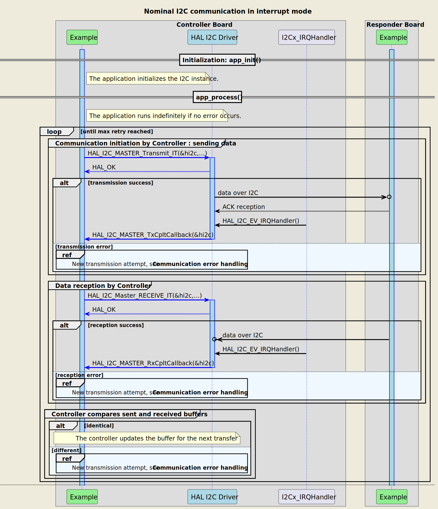
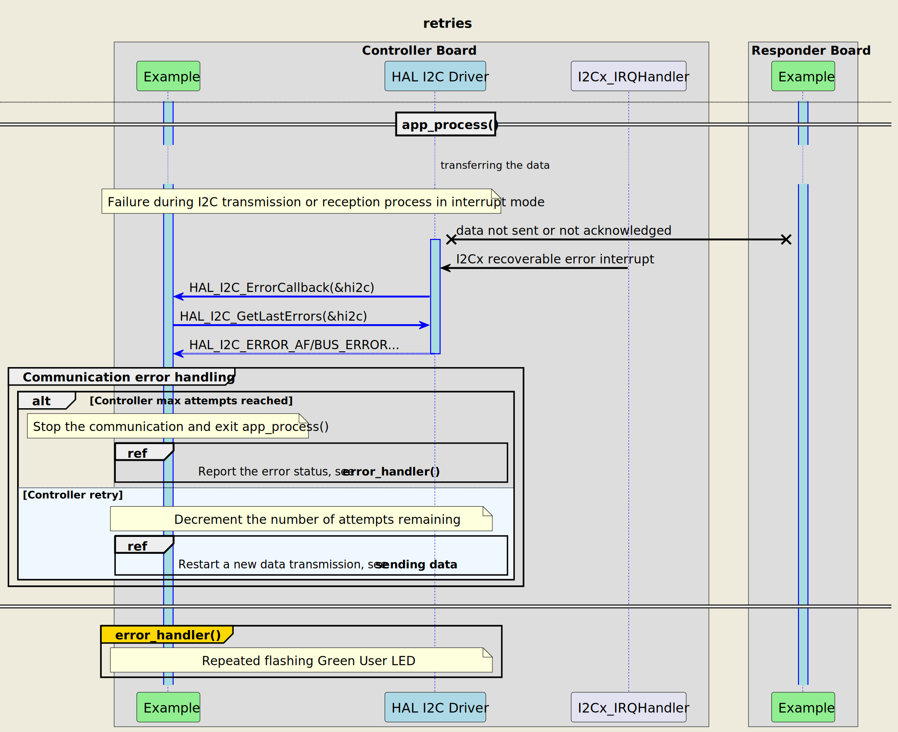
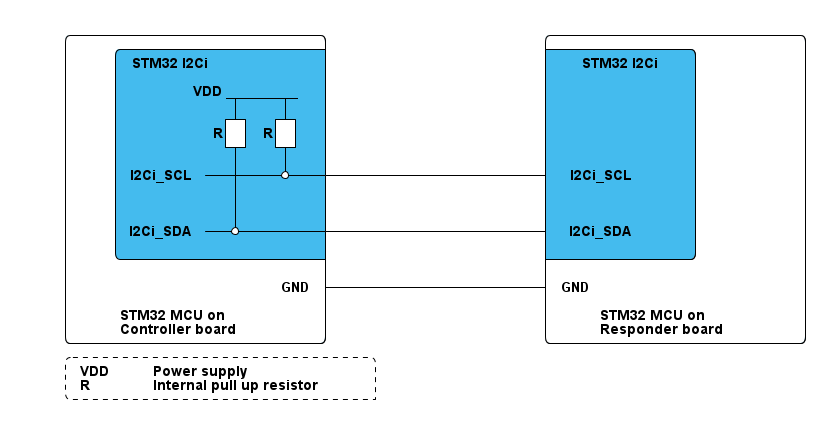

# __Example: *hal_i2c_two_boards_com_it_controller*__

[](https://dev.st.com/stm32cube-docs/examples/latest/ "Online documentation.")

How to handle an infinite number of transmit-receive transactions between two boards based on the I2C-bus protocol with the HAL API, using interrupts.

The example implements the controller's code.

**Note that the terminology Controller/Responder characterizes the role taken by each device in the I2C communication, also known as I2C master and slave in legacy terminology.**


## __1. Detailed scenario__

__Initialization phase__: At the beginning of the `main()` function, the `mx_system_init()` function is called to initialize the peripherals, the flash interface, the system clock, and the SysTick.

The application executes the following __example steps__:

__Step 1__: configures and initializes the I2C instance and the NVIC.
              Registers the user callbacks for I2C events: TX/RX transfer completed and transfer error.

__Step 2__: The controller starts the communication, in interrupt mode, by sending a message as a null-terminated string to the responder. A counter of attempts is reset when initiating the communication loop.

__Step 3__: waits for one of these I2C interrupts: write transfer complete or transfer error.

__Step 4__: The controller expects to receive the message back in interrupt mode.

__Step 5__: waits for one of these I2C interrupts: read transfer complete or transfer error.
__Step 6__: The controller checks that the sent and received buffers match.
              Returns to __Step2__ indefinitely if no error occurs.

If the data transmit or receive operation fails or the exchanged buffers are different, the controller restarts the communication by sending again the same message. The error_handler() function is called when the maximum number of attempts is reached.

The communication status is reported via the status LED and the variable ExecStatus.

__End of example__: If no error occurs, the data is transferred infinitely between the controller and the responder. If the maximum number of attempts is reached, the data transfer is stopped and an error status is reported.

If you enable **`USE_TRACE`**, you can follow these execution steps in the terminal logs:

```text
[INFO] Step 1: Device initialization COMPLETED.
[INFO] Controller - Tx/Rx Buffers IDENTICAL. Transfer COMPLETED of I2C Two Boards Communication - Message A
[INFO] Controller - Tx/Rx Buffers IDENTICAL. Transfer COMPLETED of I2C Two Boards Communication - Message B
[INFO] Controller - Tx/Rx Buffers IDENTICAL. Transfer COMPLETED of I2C Two Boards Communication - Message A
[INFO] Controller - Tx/Rx Buffers IDENTICAL. Transfer COMPLETED of I2C Two Boards Communication - Message B
```


The following **message sequence chart** describes the I2C communication between the controller board and the responder board.



<details>
<summary> Expand this tab to visualize the sequence chart diagram in case of a data transmission error. </summary>



</details>


## __2. Example configuration__

[](https://dev.st.com/stm32cube-docs/examples/latest/#:~:text=config "An offline version is also available in the STM32Cube firmware package.")

__I2C__: is configured as indicated below:

- The 7-bit addressing mode is selected:
  - The device own address is set to 0x5DU. Note that it is only used if the peripheral switches to the I2C slave mode.
  - The responder address is set to 0x3FU. It can be configured by changing the value of the I2C_RESPONDER_ADDR_7BIT variable.

> **_NOTE:_** The SADD[7:1] field of the I2C_CR2 register is written with the 7-bit responder address to be sent.
> SADD[0] is ignored, reserved for the Read/Write bit. So that the 7-bit responder address must be shifted to the left before calling I2C HAL APIs.

- The I2C IP is configured to run at the maximum supported speed to demonstrate its highest performance.
  See `__I2C maximum speed__` in section [3.2 Specific board setups](#32-specific-board-setups).
- The I2C-bus timings are calculated in line with the I2C initialization section in the reference manual.
- The event and error interrupts of the I2C instance are configured and enabled in the NVIC.
- The selected GPIO pins support the I2C alternate function. They are configured in open drain mode with internal pull-up activation.

> **_NOTE:_** In this use-case, internal pull-up resistors are used to set up the system easily and demonstrate the HAL API. Note that for a real I2C application, external pull-up resistors must be used to reach better performances.


## __3. Hardware environment and setup__

### __3.1. Generic Setup__

The controller board is connected to the responder board through the two I2C lines and a common GND.

<!--
@startuml
@startditaa{doc/generic_hardware_setup.png} -E -S
    /-------------------------\                     /-------------------------\
    |    /--------------------+                     +--------------\          |
    |    |STM32 I2Ci          |                     |  STM32 I2Ci  |          |
    |    |                    |                     |              |          |
    |    |      VDD _________ |                     |              |          |
    |    |           |    |   |                     |              |          |
    |    |          +++  +++  |                     |              |          |
    |    |         R| | R| |  |                     |              |          |
    |    |          +++  +++  |                     |              |          |
    |    |           |    |   |                     |              |          |
    |    |I2Ci_SCL---+----*---+---------------------+ I2Ci_SCL     |          |
    |    |           |        |                     |              |          |
    |    |           |   c4BE |                     |              |          |
    |    |           |        |                     |              |          |
    |    |I2Ci_SDA---*--------+---------------------+ I2Ci_SDA     |          |
    |    |               c4BE |                     |       c4BE   |          |
    |    \--------------------+                     +--------------/          |
    |                         |                     |                         |
    |                     GND +---------------------+ GND                     |
    |                         |                     |                         |
    |     STM32 MCU on        |                     |     STM32 MCU on        |
    |     Controller board    |                     |     Responder board     |
    \-------------------------/                     \-------------------------/

    /------------------------------\
    | VDD:  Power supply           |
    | R: Internal pull up resistor |
    \-=----------------------------+

@endditaa
@endumldd
-->



### __3.2. Specific board setups__

The I2C serial clock (SCL) and data (SDA) lines can be observed by connecting an oscilloscope or a logic analyzer to the corresponding board connectors.

This section describes the exact hardware configurations of your project.


<details>
<summary>On STM32U5 series.</summary>

<details>
  <summary>I2C maximum speed</summary>

The maximum speed configured for these series is 1MHz.
</details>
<details>
  <summary>On board B-U585I-IOT02A.</summary>

  | Board connector | MCU pin | Signal name | ARDUINO <br> connector pin |
  | :-------------: | :-----: | :---------: | :------------------------: |
  |     CN13-10     |   PB8   |  I2C1_SCL   |  ARDUINO CONNECTOR - D15   |
  |     CN13-9      |   PB9   |  I2C1_SDA   |  ARDUINO CONNECTOR - D14   |

</details>
<details>
  <summary>On board NUCLEO-U575ZI-Q.</summary>

  | Board connector | MCU pin | Signal name | ARDUINO <br> connector pin |
  | :-------------: | :-----: | :---------: | :------------------------: |
  |      CN7-2      |   PB8   |  I2C1_SCL   |  ARDUINO CONNECTOR - D15   |
  |      CN7-4      |   PB9   |  I2C1_SDA   |  ARDUINO CONNECTOR - D14   |
</details>
</details>

## __4. Troubleshooting__

[](https://dev.st.com/stm32cube-docs/examples/latest/#:~:text=Troubleshooting "An offline version is also available in the STM32Cube firmware package.")

Here are the points of attention for this specific example:

  __Buffer Size__: the example needs to ensure that the controller sends the exact number of bytes expected by the responder.

  __No visible signal__: if there are no I2C signals observed, remember to check these points first:
     - the GND pins of the controller and responder boards are connected.
     - the internal pull-up resistors are activated for the selected I2C pins. This configuration is enabled by default.

  __I2C signal quality__ if the I2C signals observed do not comply with the I2C specification, especially at high frequencies, you should try the following tips:
     - use the oscilloscope instead of the logic analyzer for a better measuring and viewing analog characteristics of the signals SCL and SDA. Check that the grounds of the instrument and the board are well wired.
     - replace the internal pull-up resistors with external ones. The selected values of the resistors should be compliant with the I2C specification.


## __5. See Also__

[](https://dev.st.com/stm32cube-docs/examples/latest/#:~:text=See%20Also "An offline version is also available in the STM32Cube firmware package.")

- You can find the application note AN10216-01 related to the I2C MANUAL on the [i2c-bus.org](https://www.i2c-bus.org/specification/) website if you want to go further on some technical details of the I2C bus (such as external pull-up resistors calculation for example).

- You can refer to the *hal_i2c_two_boards_com_it_responder* example pack to have a look at the responder's board application.

More information about the STM32Cube drivers can be found in the drivers' user manual of the STM32 series you are using.

For instance for the STM32U5 series: [User Manual](https://www.st.com/resource/en/user_manual/dm00813340-.pdf).

More information about the STM32 ecosystem can be found in the [STM32 MCU Developer Zone](https://www.st.com/content/st_com/en/stm32-mcu-developer-zone.html).


## __6. License__

Copyright (c) 2025 STMicroelectronics.

This software is licensed under terms that can be found in the LICENSE file in the root directory
of this software component.
If no LICENSE file comes with this software, it is provided AS-IS.
