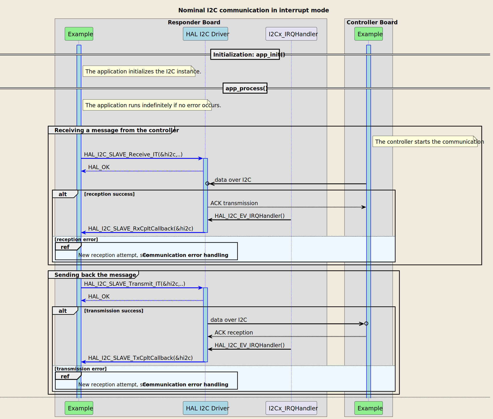
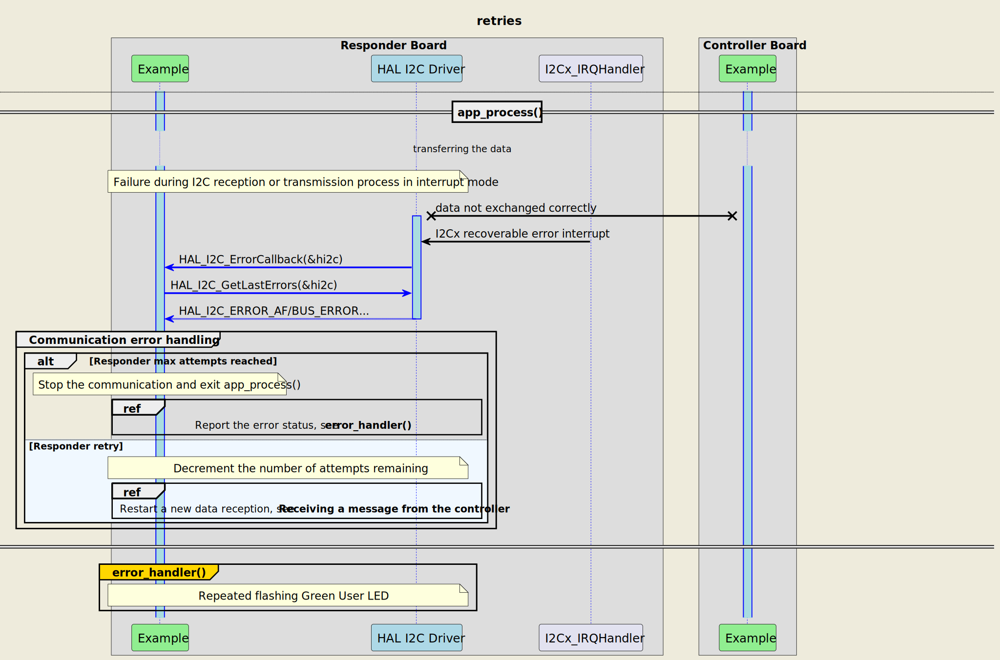
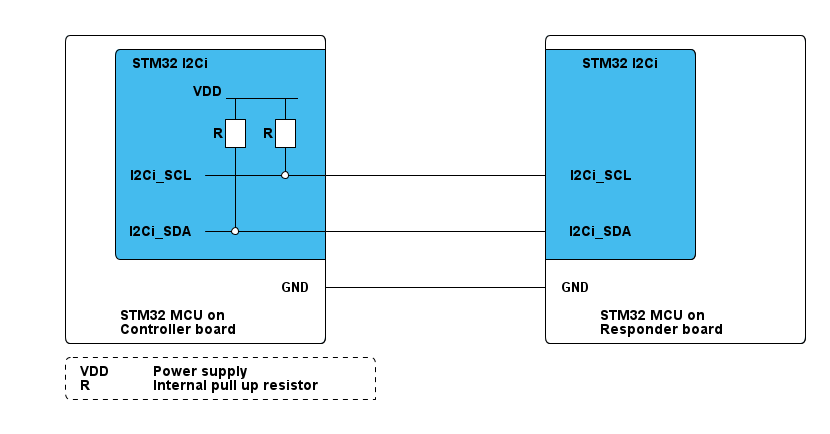

# __Example: *hal_i2c_two_boards_com_it_responder*__

[](https://dev.st.com/stm32cube-docs/examples/latest/ "Online documentation.")

How to respond in an interrupt mode I2C communication, driven by the controller, using the HAL API.
The scenario consists of an infinite number of receive-transmit transactions of changing messages.

**Note that the terminology Controller/Responder characterizes the role taken by each device in the I2C communication, also known as I2C master and slave in legacy terminology.**


## __1. Detailed scenario__

__Initialization phase__: At the beginning of the `main()` function, the `mx_system_init()` function is called to initialize the peripherals, the flash interface, the system clock, and the SysTick.

The application executes the following __example steps__:

__Step 1__: configures and initializes the I2C instance and the NVIC.
              Registers the user callbacks for I2C events: TX/RX transfer completed and transfer error.

__Step 2__: The responder expects to receive a message as a null-terminated string from the controller board, in interrupt mode. A counter of attempts is reset when initiating the communication loop.

__Step 3__: waits for one of these I2C interrupts: read transfer complete or transfer error.

__Step 4__: The responder sends back the received message in interrupt mode.

__Step 5__: waits for one of these I2C interrupts: write transfer complete or transfer error.
              Returns to __Step2__ indefinitely if no error occurs.

> **_NOTE:_** when an error occurs in the reception or transmission process, the responder restarts the reception process. The error_handler() function is called when the maximum number of attempts is reached.

The communication status is reported via the status LED and the variable ExecStatus.

__End of example__: If no error occurs, the data is transferred infinitely between the controller and the responder. If the maximum number of attempts is reached, the data transfer is stopped and an error status is reported.


If you enable **`USE_TRACE`**, you can follow these steps, in the nominal case of execution, in the terminal logs:

```text
[INFO] Step 1: Device initialization COMPLETED.
[INFO] Responder - Message received and sent back: I2C Two Boards Communication - Message A
[INFO] Responder - Message received and sent back: I2C Two Boards Communication - Message B
[INFO] Responder - Message received and sent back: I2C Two Boards Communication - Message A
```


If you enable **`USE_TRACE`**, you can follow these execution steps in the terminal logs:



<details>
<summary> Expand this tab to visualize the sequence chart diagram in case of a data reception error. </summary>



</details>


## __2. Example configuration__

[](https://dev.st.com/stm32cube-docs/examples/latest/#:~:text=config "An offline version is also available in the STM32Cube firmware package.")

__I2C__: is configured as indicated below:

- The 7-bit addressing mode is selected. The responder's own address is set to 0x3FU.
- The I2C IP is configured to run at the maximum supported speed to demonstrate its highest performance.
  See `__I2C maximum speed__` in section [3.2 Specific board setups](#32-specific-board-setups).
- The I2C-bus timings are calculated by referring to the I2C initialization section in the reference manual.
- The event and error interrupts of the I2C instance are configured and enabled in the NVIC.
- The selected GPIO pins support the I2C alternate function. They are configured in open drain mode with no pull-up neither pull-down activation.

> **_NOTE:_** The I2C protocol standard requires to have a single pull-up resistor connected from each I2C line to the power supply to enable the communication.
> We have already activated the internal pull-up resistors for the I2C pins on the controller's board side. That is why in this use-case, we do not apply this configuration on the responder's board side.


## __3. Hardware environment and setup__

### __3.1. Generic Setup__

The controller board is connected to the responder board through the two I2C lines and a common GND.

<!--
@startuml
@startditaa{doc/generic_hardware_setup.png} -E -S
    /-------------------------\                     /-------------------------\
    |    /--------------------+                     +--------------\          |
    |    |STM32 I2Ci          |                     |  STM32 I2Ci  |          |
    |    |                    |                     |              |          |
    |    |      VDD _________ |                     |              |          |
    |    |           |    |   |                     |              |          |
    |    |          +++  +++  |                     |              |          |
    |    |         R| | R| |  |                     |              |          |
    |    |          +++  +++  |                     |              |          |
    |    |           |    |   |                     |              |          |
    |    |I2Ci_SCL---+----*---+---------------------+ I2Ci_SCL     |          |
    |    |           |        |                     |              |          |
    |    |           |   c4BE |                     |              |          |
    |    |           |        |                     |              |          |
    |    |I2Ci_SDA---*--------+---------------------+ I2Ci_SDA     |          |
    |    |               c4BE |                     |       c4BE   |          |
    |    \--------------------+                     +--------------/          |
    |                         |                     |                         |
    |                     GND +---------------------+ GND                     |
    |                         |                     |                         |
    |     STM32 MCU on        |                     |     STM32 MCU on        |
    |     Controller board    |                     |     Responder board     |
    \-------------------------/                     \-------------------------/

    /------------------------------\
    | VDD:  Power supply           |
    | R: Internal pull up resistor |
    \-=----------------------------+

@endditaa
@endumldd
-->



### __3.2. Specific board setups__

The I2C serial clock (SCL) and data (SDA) lines can be observed by connecting an oscilloscope or a logic analyzer to the corresponding board connectors.

This section describes the exact hardware configurations of your project.

<details>
<summary>On STM32U5 series.</summary>

  <details>
  <summary>I2C maximum speed</summary>

The maximum speed configured for these series is 1MHz.
  </details>
  <details>
  <summary>On board B-U585I-IOT02A.</summary>

  | Board connector | MCU pin | Signal name | ARDUINO <br> connector pin |
  | :-------------: | :-----: | :---------: | :------------------------: |
  |     CN13-10     |   PB8   |  I2C1_SCL   |  ARDUINO CONNECTOR - D15   |
  |     CN13-9      |   PB9   |  I2C1_SDA   |  ARDUINO CONNECTOR - D14   |

  </details>
  <details>
  <summary>On board NUCLEO-U575ZI-Q.</summary>

  | Board connector | MCU pin | Signal name | ARDUINO <br> connector pin |
  | :-------------: | :-----: | :---------: | :------------------------: |
  |      CN7-2      |   PB8   |  I2C1_SCL   |  ARDUINO CONNECTOR - D15   |
  |      CN7-4      |   PB9   |  I2C1_SDA   |  ARDUINO CONNECTOR - D14   |
  </details>
</details>

## __4. Troubleshooting__

[](https://dev.st.com/stm32cube-docs/examples/latest/#:~:text=Troubleshooting "An offline version is also available in the STM32Cube firmware package.")

Here are the points of attention for this specific example:

  __Buffer Size__: the example needs to ensure that the number of bytes expected by the responder is equal to the size of the message sent by the controller. Note that the size of the responder's Rx buffer can be adjusted by modifying the BUFFER_SIZE constant.

  __No visible signal__: if there are no I2C signals observed, remember to check these points first:
     - the GND pins of the controller and responder boards are connected.
     - the internal pull-up resistors are activated for the selected I2C pins on the controller side. This configuration is enabled by default in the controller example that we provide.

  __I2C signal quality__: if the I2C signals observed do not comply with the I2C specification, especially at high frequencies, you should try the following tips:
     - use the oscilloscope instead of the logic analyzer for a better measuring and viewing analog characteristics of the signals SCL and SDA. Check that the grounds of the instrument and the board are well wired.
     - replace the internal pull-up resistors with external ones. The selected values of the resistors should be compliant with the I2C specification.


## __5. See Also__

[](https://dev.st.com/stm32cube-docs/examples/latest/#:~:text=See%20Also "An offline version is also available in the STM32Cube firmware package.")

- You can find the application note AN10216-01 related to the I2C MANUAL on the [i2c-bus.org](https://www.i2c-bus.org/specification/) website if you want to go further on some technical details of the I2C bus (such as external pull-up resistors calculation for example).

- You can refer to the *hal_i2c_two_boards_com_it_controller* example pack to have a look at the controller's board application.

More information about the STM32Cube drivers can be found in the drivers' user manual of the STM32 series you are using.

For instance for the STM32U5 series: [User Manual](https://www.st.com/resource/en/user_manual/dm00813340-.pdf).

More information about the STM32 ecosystem can be found in the [STM32 MCU Developer Zone](https://www.st.com/content/st_com/en/stm32-mcu-developer-zone.html).


## __6. License__

Copyright (c) 2025 STMicroelectronics.

This software is licensed under terms that can be found in the LICENSE file in the root directory
of this software component.
If no LICENSE file comes with this software, it is provided AS-IS.
