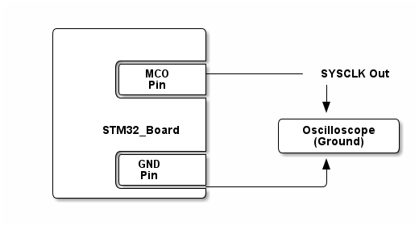

# __Example: *hal_rcc_lsi_config*__

[](https://dev.st.com/stm32cube-docs/examples/latest/ "Online documentation.")

How to configure the LSI (Low Speed Internal) clock and enable/disable it using the RCC HAL APIs.


## __1. Detailed scenario__

__Initialization phase__: At the beginning of the `main()` function, the `mx_system_init()` function is called to initialize all the peripherals, the flash interface, the system clock, and the SysTick.

The application executes the following __example steps__:

__Step 1__: The MCO (Microcontroller Clock Output) is configured to output the LSI. The backup domain
access is granted if necessary to be able to change the LSI state. The backup domain is reset to ensure a clean state for the LSI.

__Step 2__: The LSI is enabled for LSI_ENABLE_DELAY_MS ms, then disabled.

__Step 3__: Stops providing the LSI signal on the MCO pin.

__End of example__: After step 3, the example terminates. You can check the status LED.

If you enable `USE_TRACE`, you can follow these steps in the terminal logs:
(Here is an example with the NUCLEO-U575ZI-Q, the default LSI frequency may differ for another board)

```text
[INFO] Step 1: LSI output (32000 Hz) to MCO pin, with a 1 divider (MCO freq: 32000 Hz).
[INFO] Step 1: LSI and MCO initialized.
[INFO] Step 2: LSI enabled to 32000 Hz.
[INFO] Step 2: LSI disabled.
[INFO] Step 3: stop to output LSI on MCO pin.
```


## __2. Example configuration__

[](https://dev.st.com/stm32cube-docs/examples/latest/#:~:text=config "An offline version is also available in the STM32Cube firmware package.")

This example demonstrates the following peripheral:

__RCC__:

The example uses the RCC to enable and disable the LSI clock.


## __3. Hardware environment and setup__

### __3.1. Generic Setup__

No specific hardware setup is needed for this example.
Nevertheless, an oscilloscope may also be used to monitor the system clock value on the MCO pin.

<!--
@startditaa doc/example_hal_rcc_lsi_config.png
    /------------------\
    |                  |
    |                  |
    |       /----------+
    |       |   MCO    +------------ SYSCLK Out
    |       |   Pin    |              |
    |       \----------+              |
    |                  |              v
    |                  |        /--------------\
    |     STM32_Board  |        | Oscilloscope |
    |                  |        |   (Ground)   |
    |       /----------+        \--------------/
    |       |  GND     |              ^
    |       |  Pin     |              |
    |       \----------+--------------/
    \------------------/
@endditaa
-->



### __3.2. Specific board setups__

This section describes the exact hardware configurations of your project.

<details>
<summary>On STM32U5 series.</summary>
<details>
  <summary>On board B-U585I-IOT02A.</summary>

  | Board connector   | MCU pin | Signal name | ARDUINO <br> connector pin |
  | :---:             | :---:   | :---:       | :---:                      |
  | CN13-2            | D9      | MCO         | ARDUINO CONNECTOR - D9     |
</details>
<details>
  <summary>On board NUCLEO-U575ZI-Q.</summary>

  | Board connector   | MCU pin | Signal name | ARDUINO <br> connector pin |
  | :---:             | :---:   | :---:       | :---:                      |
  | CN10-31           | PA8     | MCO         | ARDUINO CONNECTOR - D33    |
</details>
</details>

## __4. Troubleshooting__

[](https://dev.st.com/stm32cube-docs/examples/latest/#:~:text=Troubleshooting "An offline version is also available in the STM32Cube firmware package.")

Here are the points of attention for this specific example:

__LSI state__: For some series, LSI is part of the backup domain and access to it must be granted to modify the LSI state. The backup domain must also be reset to prevent an unknown state, but this reset might impact other peripherals, the user needs to take care of its use.


## __5. See Also__

[](https://dev.st.com/stm32cube-docs/examples/latest/#:~:text=See%20Also "An offline version is also available in the STM32Cube firmware package.")

You can find more information on the reference manual of your chosen MCU, in the *reset and clock control (RCC)* section.
For example, here is the [STM32U575/585 RefMan](https://www.st.com/resource/en/reference_manual/rm0456-stm32u575585-armbased-32bit-mcus-stmicroelectronics.pdf).

More information about the STM32Cube Drivers can be found in the drivers' user manual of the STM32 series you are using.

For instance for the STM32U5 series: [User Manual](https://www.st.com/resource/en/user_manual/dm00813340-.pdf).

More information about the STM32 ecosystem can be found in the [STM32 MCU Developer Zone](https://www.st.com/content/st_com/en/stm32-mcu-developer-zone.html).


## __6. License__

Copyright (c) 2025 STMicroelectronics.

This software is licensed under terms that can be found in the LICENSE file in the root directory
of this software component.
If no LICENSE file comes with this software, it is provided AS-IS.
