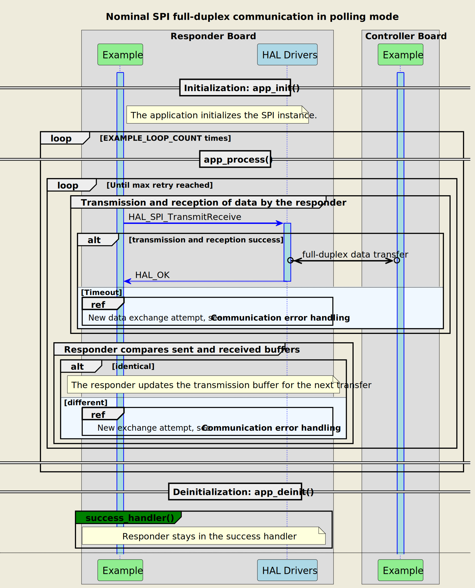
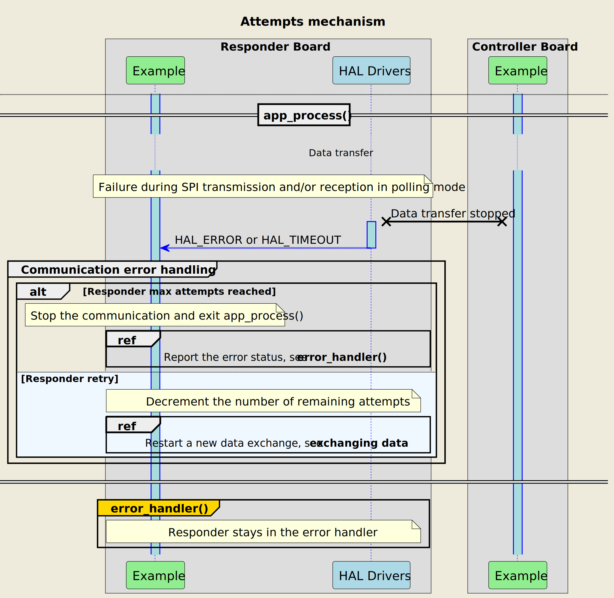
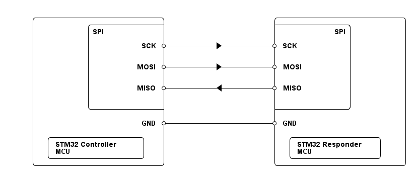

# __Example: *hal_spi_full_duplex_two_boards_com_polling_responder*__

[](https://dev.st.com/stm32cube-docs/examples/latest/ "Online documentation.")

How to manage a full duplex synchronous SPI communication as responder, in polling mode, using the HAL APIs.


## __1. Detailed scenario__

The scenario consists of a limited number of transmit-receive transactions of changing messages.

Although the transmission buffers of the controller and responder are constructed independently, they must have the same length.
To simplify the demonstration, identical buffers are used for transmission.

__Initialization phase__: At the beginning of the `main()` function, the `mx_system_init()` function is called to initialize the peripherals, the flash interface, the system clock, and the SysTick.

The application executes the following __example steps__:

__Step 1__: Configures and initializes the SPI instance.

__Step 2__: Establishes communication with the controller in full duplex blocking mode. The responder exchanges data (transmitting and receiving) within a specific timeout period. The application tracks the number of allowed attempts for successful information exchange and resets this count at the beginning of each communication loop.

__Step 3__: checks that the sent and received buffers match.
            Processes this loop 10 times, returning to step 2 until `EXAMPLE_LOOP_COUNT` is reached or an error occurs.

On most boards, the LED shares its pin with the SPI SCK. Therefore, this example does not have a status LED.

__End of example__: While no error occurs, the data is transferred 10 times between the controller and the responder. In case of failure or the maximum number of attempts is reached, the data transfer is stopped and an error status is reported to the `main()` function.

If the data transmit or receive operation fails or the exchanged buffers are different, the controller restarts the communication by sending again the same message. The `error_handler()` function is called when the maximum number of attempts is reached.

If you enable **`USE_TRACE`**, you can follow these steps, in the nominal case of execution, in the terminal logs:

```text
[INFO] Step 1: Device initialization COMPLETED.
[INFO] Responder - Tx/Rx Buffers IDENTICAL. Transfer COMPLETED of SPI Full Duplex Two Boards Communication - Message A
[INFO] Responder - Tx/Rx Buffers IDENTICAL. Transfer COMPLETED of SPI Full Duplex Two Boards Communication - Message B
[INFO] Responder - Tx/Rx Buffers IDENTICAL. Transfer COMPLETED of SPI Full Duplex Two Boards Communication - Message A
[INFO] Responder - Tx/Rx Buffers IDENTICAL. Transfer COMPLETED of SPI Full Duplex Two Boards Communication - Message B
```

The following **message sequence chart** is used to describe the SPI communication behavior between the controller board and the responder board.



<details>
<summary> Expand this tab to visualize the sequence chart diagram of the communication attempts' mechanism. </summary>



</details>


## __2. Example configuration__

[](https://dev.st.com/stm32cube-docs/examples/latest/#:~:text=config "An offline version is also available in the STM32Cube firmware package.")

The example demonstrates the following peripheral:

__SPI__:

The example uses SPI full-duplex synchronous transfers on three lines (MOSI, MISO, and the clock signal) to send and receive data simultaneously between the controller and the responder.
For this purpose, the SPI instance of the responder board should be configured to the 'Slave' mode, and the direction should be set to two lines.

In addition, it is necessary to set the clock polarity as either LOW or HIGH.
Also configure the clock phase to:

- Either one edge if the first clock transition corresponds to the first data capture edge,
- Or two edges if the second clock transition represents the first data capture edge.

For the current project, the clock polarity is set to LOW, while the clock phase is configured as one edge.


## __3. Hardware environment and setup__

### __3.1. Generic Setup__

This section describes the hardware setup principles that apply to any board.

<!--
@startuml
@startditaa{doc/ASCII_spi_two_boards.png} -E -S

    /-------------------------\                     /-------------------------\
    |          /--------------+                     +--------------\          |
    |          |SPI           |                     |           SPI|          |
    |          |              |                     |              |          |
    |          |          SCK *--------+->----------* SCK          |          |
    |          |              |                     |              |          |
    |          |              |                     |              |          |
    |          |         MOSI *--------+->----------* MOSI         |          |
    |          |              |                     |              |          |
    |          |              |                     |              |          |
    |          |         MISO *----------<----------* MISO         |          |
    |          |              |                     |              |          |
    |          |              |                     |              |          |
    |          \--------------+                     +--------------/          |
    |                         |                     |                         |
    |                     GND *---------------------* GND                     |
    |                         |                     |                         |
    |  /------------------\   |                     |  /-----------------\    |
    |  | STM32 Controller |   |                     |  | STM32 Responder |    |
    |  | MCU              |   |                     |  | MCU             |    |
    |  \------------------/   |                     |  \-----------------/    |
    \-------------------------/                     \-------------------------/

@endditaa
@enduml
-->



### __3.2. Specific board setups__

This section describes the exact hardware configurations of your project.


<details>
<summary>On STM32U5 series.</summary>
<details>
  <summary>On board B-U585I-IOT02A.</summary>

  | Board connector   | MCU pin | Signal name | ARDUINO <br> connector pin |
  | :---:             | :---:   | :---:       | :---:                      |
  | CN13-6            | PE13    | SPI1_SCK    | ARDUINO CONNECTOR - D13    |
  | CN13-5            | PE14    | SPI1_MISO   | ARDUINO CONNECTOR - D12    |
  | CN13-4            | PE15    | SPI1_MOSI   | ARDUINO CONNECTOR - D11    |

</details>
<details>
  <summary>On board NUCLEO-U575ZI-Q.</summary>

  | Board connector   | MCU pin | Signal name  | ARDUINO <br> connector pin |
  | :---:             | :---:   | :---:        | :---:                      |
  | CN7-10            | PA5     | SPI1_SCK     | Zio CONNECTOR - D13        |
  | CN7-12            | PA6     | SPI1_MISO    | Zio CONNECTOR - D12        |
  | CN7-14            | PA7     | SPI1_MOSI    | Zio CONNECTOR - D11        |

</details>
</details>

## __4. Troubleshooting__

[](https://dev.st.com/stm32cube-docs/examples/latest/#:~:text=Troubleshooting "An offline version is also available in the STM32Cube firmware package.")

Find below the points of attention for this specific example.

__Pins alignment__: When connecting the pins of the controller board to the ones of the responder board, the MOSI and MISO lines should not be crossed. So, the MISO line of the controller is connected to the MISO line of the responder, and the same goes for the MOSI line.

__Initial synchronization__: If the responder board is not prepared to exchange messages with the controller, the controller transmits and receives data. However, the reception buffer is empty in this case. This leads to an error during the check of the buffers. If **`USE_TRACE`** is enabled, you can see errors messages on the terminal.

__LED twinkling__: Most boards have a LED connected to the same pin as SPI SCK from arduino connector. This LED can twinkle during SPI communications.


## __5. See Also__

[](https://dev.st.com/stm32cube-docs/examples/latest/#:~:text=See%20Also "An offline version is also available in the STM32Cube firmware package.")

You can also refer to these examples to go further with the SPI peripheral:

- hal_spi_full_duplex_two_boards_com_polling_controller: full duplex synchronous SPI communication as controller, in polling mode.

More information about the STM32Cube Drivers can be found in the drivers' user manual of the STM32 series you are using.

For instance for the STM32U5 series: [User Manual](https://www.st.com/resource/en/user_manual/dm00813340-.pdf).

More information about the STM32 ecosystem can be found in the [STM32 MCU Developer Zone](https://www.st.com/content/st_com/en/stm32-mcu-developer-zone.html).


## __6. License__

Copyright (c) 2025 STMicroelectronics.

This software is licensed under terms that can be found in the LICENSE file in the root directory
of this software component.
If no LICENSE file comes with this software, it is provided AS-IS.
