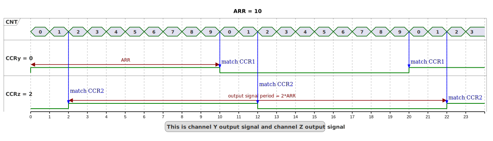

# __Example: *hal_tim_oc_toggle*__

## __1. Detailed scenario__

This scenario demonstrates how to configure a timer to generate two signals PWM in output compare mode with delays between them using the same frequency.

__Initialization phase__:
  At the beginning of the main program, the `mx_system_init()` function is called to initialize the peripherals, the flash interface, the system clock, and the SysTick.

The application executes the following __example steps__:

__Step 1__: Initializes the timer's input clock, counter clock, output clock, output channels and the GPIO pins.

__Step 2__: Starts the timer in Output Capture Toggle mode for the two channels.

__End of example__: If no error occurs, the PWM signal is generated indefinitely.

## __2. Example configuration__

### __2.1. Timer configuration:__

The *TIM* is configured as follows:

- The timer channels (say 'y' and 'z') are configured in Output Compare Toggle mode.
- The timer prescaler is configured to set the timer counter clock to 1 MHz (period: 1ms).
- To obtain a delay of 250 microseconds between two signals, the Output Compare (OC) toggle frequencies are configured as follows:
  TIM_CCRy register value is equal to 1
  TIM_CCRz register value is equal to 251
- The toggle of output signal frequency is configured at 1000 Hz. Thus output signal frequency is 500Hz.
- The output signal will be a 50% PWM, which is implicit with OC toggle static configuration.
- The toggle frequency is twice the PWM frequency because the signal toggles twice per PWM period (once for the high phase and once for the low phase).

 _Note that:_

  - The timer configuration depends on the timer peripheral input clock, which is derived from the system clock tree.
  - In the context of Output Compare Toggle mode, it is essential to ensure that the Capture Compare Register (TIM_CCRx) values are lower than the ARR value. This is because the TIM_CCRx values dictate the points at which the output signal toggles (from high to low or low to high).
So, it is required to define the system clock configuration and to determine the timer input clock before defining the timer configuration.

The system clock configuration is specific to each STM32 MCU (see section [Hardware environment and setup](#3-hardware-environment-and-setup)).

#### __2.1.1. Output Compare Toggle frequency configuration:__

The Auto-Reload Register (ARR) defines the period of the timer counter. It determines how many timer counter clock (tim_cnt_ck) cycles occur before the counter resets to zero. The ARR value can be calculated using the following formula:

    PWM period = tim_cnt_ck period * 2 * (ARR + 1)
    PWM frequency = tim_cnt_ck frequency / (2 * (ARR + 1))
    ARR = (tim_cnt_ck frequency / (2 * PWM frequency)) - 1

In Output Compare Toggle mode, the output signal toggles (from high to low or low to high) each time the counter reaches the TIM_CCRx value. Therefore, the toggle frequency can be calculated as half of the update rate because it takes two toggles to complete one full PWM cycle.

As Output compare preload is enabled, the pulse value is taken into account at the next update event (UEV), which occurs when the counter reaches the ARR or CRR value. To correctly synchronize both channels, the TIM_CCRy value is set to 1 (not 0) to trigger an update event on the first timer loop.

Output compare toggle timing diagram:

  
Numerical calculations:

    The timer's counter clock is set to 1MHz (see prescaler computation in section [Hardware environment and setup](#3-hardware-environment-and-setup))
    To set a PWM frequency to 500 Hz with a 1MHz timer counter clock:

      ARR = (1MHz / (2 * 500Hz)) - 1 = 999

    The delay between two signals is calculated as follows:

      Delay = (TIM_CCRz - TIM_CCRy) / tim_cnt_ck
      Delay = (251 - 1) / 1000000
      Delay = 250 us

 _Note that:_

  - _A counter counts clock cycles from 0 to the ARR value, so (ARR + 1) clock cycles are counted._
  - _A Prescaler register allows to divide a clock like tim_cnt_ck by 1 to 65536 but can only have values from 0 to 65535. So, when the TIM_PSC register value is N, the clock is divided by N + 1._

## __3. Hardware environment and setup__

### __3.1. Generic Setup__

The PWM signals generated by the timer channels can be displayed by connecting an oscilloscope to the corresponding board connectors.

### __3.2. Specific board setups__

This section focuses on the clock settings as this is critical to obtain the desired signals PWM in output compare mode.

  
On STM32U5 series.

  
Common configuration

   Timer's counter clock configuration with AHB prescalers and APB prescalers set to 1:

  - The AHB clock (HCLK) and system core clock are set to system clock (SYSCLK).
  - The timer's internal input clock (tim_ker_ck) is set to its respective APB clock (PCLK).

      tim_ker_ck = PCLK = HCLK = SYSCLK (system clock)

      So, tim_ker_ck = HCLK in Hz

  To obtain the timer's counter clock frequency (tim_cnt_ck), the timer prescaler register (TIM_PSC) is computed as follows:

      TIM_PSC = (HCLK / tim_cnt_ck) - 1

  Standard STM32U5xx MCUs' peripheral clocks diagram:

<!--
@startuml
@startditaa{doc/stm32_peripherals_clocks.png}
 +---------+
 | clock   |
 | source  |
 | control |
 +---+-----+
     |
    ++-\
  --+  |
    |  |
    |  |
  --+  |           +---------------+        +--------------+_
    |  |  SYSCLCK  |  AHB          |  HCLK  |  APBx        |  PCLKx
    |  +-----------+  PRESC        +--------+  PRESC       +---+----------------------------
  --+  |           |  / 1,2,...512 |        | / 1,2,4,8,16 |   |      To APBx peripherals
    |  |           +---------------+        +--------------+   |
    |  |                                                       |   +----------+   tim_ker_ck
  --+  |                                                       +---+ x1 or x2 +-------------
    |  |                                                           +----------+  To TIMx
    +--/
@endditaa
@enduml
-->

In this configuration:

- The HCLK is set to 160MHz.
- The timer counter clock (tim_cnt_ck) is set to 1 MHz.

To obtain a timer counter clock frequency (tim_cnt_ck) at 1MHz with the APB prescaler set to 1 and the HCLK set to 160MHz, the timer prescaler register (TIM_PSC) must be:

      TIM_PSC = (HCLK / tim_cnt_ck) - 1
      TIM_PSC = (160 MHz / 1 MHz) - 1 = 159

  
On board B-U585I-IOT02A.

  Timer resources used:

   - TIM1
      - CH1 for channel y
      - CH4 for channel z

  | Board connector  and pin  | CPU pin | Signal name | ARDUINO  connector pin |
  | :---:                        | :---:   | :---:       | :---:                     |
  | CN13-2                       | PA8     | TIM1_CH1    | ARDUINO CONNECTOR - D9    |
  | CN13-5                       | PE14    | TIM1_CH4    | ARDUINO CONNECTOR - D12   |

  
On board NUCLEO-C562RE.

  Timer resources used:

   - TIM2
      - CH2 for channel y
      - CH3 for channel z

  | Board connector  and pin  | CPU pin | Signal name | ARDUINO  connector pin |
  | :---:                        | :---:   | :---:       | :---:                     |
  | CN9-4                        | PB3     | TIM2_CH2    | ARDUINO CONNECTOR - D6    |
  | CN9-7                        | PB10    | TIM2_CH3    | ARDUINO CONNECTOR - D3    |

  
On board NUCLEO-U575ZI-Q.

  Timer resources used:

   - TIM1
      - CH1 for channel y
      - CH3 for channel z

  | Board connector  and pin  | CPU pin | Signal name | ARDUINO  connector pin |
  | :---:                        | :---:   | :---:       | :---:                     |
  | CN10-4                       | PE9     | TIM1_CH1    | ARDUINO CONNECTOR - D6    |
  | CN10-10                      | PE13    | TIM1_CH3    | ARDUINO CONNECTOR - D3    |

## __4. Troubleshooting__

Here are the points of attention for this specific example:

- The timer clock is dependent of the clock configuration, so changing the CPU clock or clock peripheral bus clock affects the PWM frequency and the delay.

## __5. See Also__

This [General-purpose timer cookbook for STM32 microcontrollers (ref. AN4776)](https://www.st.com/content/ccc/resource/technical/document/application_note/group0/91/01/84/3f/7c/67/41/3f/DM00236305/files/DM00236305.pdf/jcr:content/translations/en.DM00236305.pdf) provides a simple and clear description of the basic features and operating modes of the STM32 general-purpose timer peripherals.

This [STM32 cross-series timer overview (ref. AN4013)](https://www.st.com/content/ccc/resource/technical/document/application_note/54/0f/67/eb/47/34/45/40/DM00042534.pdf/files/DM00042534.pdf/jcr:content/translations/en.DM00042534.pdf) present an overview of the timer peripherals for the STM32 product series.

More information about the STM32 Cube Drivers can be found in the drivers' user manual of the STM32 series you are using.

For instance for the STM32U5 series: [User Manual](https://www.st.com/resource/en/user_manual/dm00813340-.pdf).

More information about the STM32 ecosystem can be found in the [STM32 MCU Developer Zone](https://www.st.com/content/st_com/en/stm32-mcu-developer-zone.html).

## __6. License__

Copyright (c) 2025 STMicroelectronics.

This software is licensed under terms that can be found in the LICENSE file in the root directory
of this software component.
If no LICENSE file comes with this software, it is provided AS-IS.
