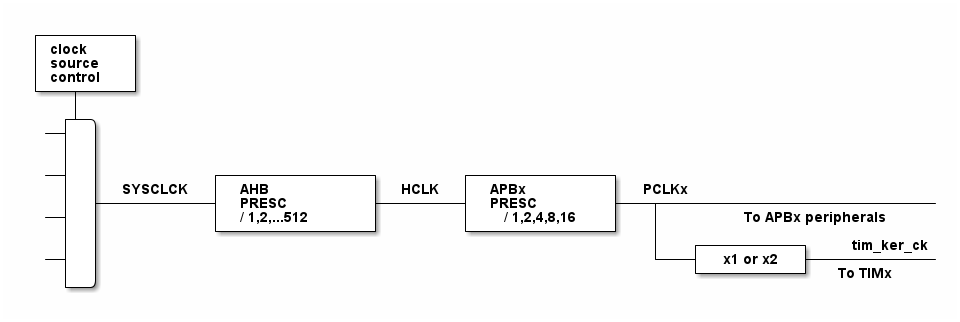

# __Example: *hal_tim_pwm_output*__

How to configure the TIM peripheral in PWM (Pulse Width Modulation) mode.
The PWM waveforms generated by the timer channels can be displayed using an oscilloscope.

## __1. Detailed scenario__

This scenario demonstrates how to configure a timer to generate several PWM signals.

__Initialization phase__: At the beginning of the `main()` function, the `mx_system_init()` function is called to initialize the peripherals, the flash interface, the system clock, and the SysTick.

The application executes the following __example steps__:

__Step 1__: Initializes the timer's input clock, counter clock, output clock. Sets the output channels' duty cycles, and the GPIO pins.

__Step 2__: Starts the timer PWM generation for both channels.

__End of example__: If no error occurs, the PWM signal is generated indefinitely.

## __2. Example configuration__

### __2.1. Timer configuration__

The *TIM* is configured as follows:

- The timer channels (say 'y' and 'z') are configured as PWM generator in up counting PWM mode 1.
- The timer prescaler is configured to set the timer counter clock to 1 MHz.
- The PWM duty cycle is configured at 50% for channel y, 37.5% for channel z.
- The PWM frequency is configured at 24 kHz.

Note that the timer configuration depends on the timer peripheral input clock, which is derived from the system clock tree.
So, it is required to define the system clock configuration and to determine the timer input clock before defining the timer configuration.

The system clock configuration is specific to each STM32 MCU (see section [Hardware environment and setup](#3-hardware-environment-and-setup)).

#### __2.1.1. PWM frequency and duty cycles configuration:__

The timer's autoreload register (ARR) defines the PWM period in number of timer counter clock (tim_cnt_ck) cycles.
The ARR value is chosen as indicated below:

    PWM period = tim_cnt_ck period * (ARR + 1)
    PWM frequency = tim_cnt_ck frequency / (ARR + 1)
    ARR = (tim_cnt_ck frequency / PWM frequency) - 1

The timer's capture/compare channel is used to define the PWM duty cycle.
It is configured by setting the timer's Capture Compare Register (CCR).

The CCR defines the duration of the output active state in number of tim_cnt_ck cycles, and its value should be strictly lower than (ARR + 1).

The PWM duty cycle, expressed as a percentage, is calculated as the ratio of the output active state to the PWM period, multiplied by 100:

    duty_cycle_percent = (CCR / (ARR + 1)) * 100
    CCR = (duty_cyle_percent * (ARR + 1)) / 100

  
Numerical calculations

  The timer's counter clock is set to 1MHz (see prescaler computation in section [Hardware environment and setup](#3-hardware-environment-and-setup)).

  To set a PWM output frequency to 24kHz with a 1MHz timer counter clock:

    ARR = (1 MHz / 24 kHz) - 1
    ARR = (1000000 / 24000) - 1 = 40.66
    ARR = 40 (integer rounded down to fit into the register)

   To set the channel y's PWM duty cycle to 50%:

    CCRy = (50 / 100) * 41 = 20.5
    CCRy = 20 (integer rounded down to fit into the register)

   To set the channel z's PWM duty cycle to 37.5%:

    CCRz = (37.5 / 100) * 41 = 15.375
    CCRz = 15 (integer rounded down to fit into the register)

  > **_NOTE:_** Registers like CCR (Capture Compare Register) and ARR (Auto-Reload Register) are of integer type. In all calculations, the result is truncated. Therefore, the theoretical period and duty cycle must be recalculated using the actual ARR and CCR values.

If we recalculate them with this configuration:

- The PWM output frequency is _1MHz / 41 = 24,39 kHz_
- The channel y PWM output duty cycle is _20 / 41 = 48.78%_
- The channel z PWM output duty cycle is _15 / 41 = 36.58%_

 Note that:

  - A counter counts clock cycles from 0 to the ARR value, so (ARR + 1) clock cycles are counted.
  - __Timer Output Channel__: In PWM mode 1, the timer output channel is active when the timer counter register is strictly lower than CCR. Otherwise, it is inactive.
  - __Prescaler__: The prescaler value (N) ranges from 0 to 65535, and the clock frequency (tim_ker_ck) is divided by N + 1.

#### __2.1.2. PWM frequency and duty cycles limits:__

The frequencies and duty cycles values mentioned below are theoretical.
These values might be slightly different depending on variations in the root source clock (HSI/HSE, etc.).

Since the timer counter clock (tim_cnt_ck) and the ARR values are used to configure the PWM frequency, they define the limits of the PWM frequency and duty cycle.

 

  
PWM frequency limits

  The maximum PWM frequency (F_max) is achieved when ARR is 1:

      F_max = tim_cnt_ck / (ARR + 1)
      F_max = tim_cnt_ck / 2

  The minimum PWM frequency (F_min) is achieved when:

  - ARR is 0xFFFF for a 16bit timer,
  - ARR is for 0xFFFFFFFF a 32bit timer.

  This gives:

      F_min = tim_cnt_ck / (ARR + 1)
      F_min = tim_cnt_ck / 0x10000 (for a 16-bit timer)
      F_min = tim_cnt_ck / 0x100000000 (for a 32-bit timer)

  When the ARR value is 0 the timer output channel is always 0, representing a 0% PWM duty cycle.

  > **_CONCLUSION_**: F_min and F_max depend on tim_cnt_ck computed from both the timer prescaler and the timer input clock, which is derived from the system clock tree.

  
PWM duty cycle limits

  A __100% duty cycle__ is reached when the CCR value is strictly greater than the ARR value, as the PWM output signal is held to active state.

  A __0% duty cycle__ is reached when the CCR value is equal to 0, as the PWM output signal is held to an inactive state.

  The PWM active state and PWM period have a precision of one tim_cnt_ck cycle.

  Note that when the ARR value is 1 the only possible duty cycles are 0%, 50%, and 100%.

### __2.2. GPIO configuration__

Two pins must be configured, one for each PWM signal: [see the specific boards setups](#32-specific-board-setups)

The GPIO pins are configured in:

- Alternate function as a timer output channel of its respective timer instance.
- Push-pull mode with no pull-up or pull-down resistors activated.

## __3. Hardware environment and setup__

### __3.1. Generic Setup__

The PWM signals generated by the timer channels can be displayed by connecting an oscilloscope to the corresponding board connectors.

### __3.2. Specific board setups__

  
On STM32U5 series.

  

  
Common configuration.

  Timer's counter clock configuration with prescalers and APB prescalers set to 1:

  - The AHB clock (HCLK) and system core clock are set to system clock (SYSCLK).
  - The timer's internal input clock (tim_ker_ck) is set to its respective APB clock (PCLK).

      tim_ker_ck = PCLK = HCLK = SYSCLK (system clock)

      So, tim_ker_ck = HCLK in Hz

  To obtain the timer's counter clock frequency (tim_cnt_ck), the timer prescaler register (TIM_PSC) is computed as follows:

      TIM_PSC = (HCLK / tim_cnt_ck ) - 1

  Standard STM32U5xx MCUs' peripheral clocks diagram:

<!--
@startuml
@startditaa{doc/stm32u5_peripherals_clocks.png}
 +---------+
 | clock   |
 | source  |
 | control |
 +---+-----+
     |
    ++-\
  --+  |
    |  |
    |  |
  --+  |           +---------------+        +--------------+
    |  |  SYSCLCK  |  AHB          |  HCLK  |  APBx        |  PCLKx
    |  +-----------+  PRESC        +--------+  PRESC       +---+----------------------------
  --+  |           |  / 1,2,...512 |        | / 1,2,4,8,16 |   |      To APBx peripherals
    |  |           +---------------+        +--------------+   |
    |  |                                                       |   +----------+   tim_ker_ck
  --+  |                                                       +---+ x1 or x2 +-------------
    |  |                                                           +----------+  To TIMx
    +--/
@endditaa
@enduml
-->

In this configuration:

- The HCLK is set to 160MHz.
- The timer counter clock is set to 1 MHz.

To obtain a timer counter clock at 1MHz with the APB prescaler set to 1 and the HCLK set to 160MHz, the timer prescaler must be:

      timer_prescaler = (160 MHz / 1 MHz) - 1 = 159

  
On board B-U585I-IOT02A.

  The selected timer is TIM1, with:

  - TIM1_CH1 for channel y
  - TIM1_CH4 for channel z

  | Board connector  and pin  | CPU pin | Signal name | ARDUINO  connector pin |
  | :---:                        | :---:   | :---:       | :---:                     |
  | CN13-2                       | PA8     | TIM1_CH1    | ARDUINO CONNECTOR - D9    |
  | CN13-5                       | PE14    | TIM1_CH4    | ARDUINO CONNECTOR - D12   |

  
On board NUCLEO-U545RE-Q.

  The selected timer is TIM1, with:

  - TIM1_CH1 for channel y
  - TIM1_CH3 for channel z

  | Board connector  and pin  | CPU pin | Signal name | ARDUINO  connector pin |
  | :---:                        | :---:   | :---:       | :---:                     |
  | CN9-8                        | PA8     | TIM1_CH1    | ARDUINO CONNECTOR - D7    |
  | CN10-4                       | PA10    | TIM1_CH3    | -                         |

  
On board NUCLEO-U575ZI-Q.

  The selected timer is TIM1, with:

  - TIM1_CH1 for channel y
  - TIM1_CH3 for channel z

  | Board connector  and pin  | CPU pin | Signal name | ARDUINO  connector pin |
  | :---:                        | :---:   | :---:       | :---:                     |
  | CN10-4                       | PE9     | TIM1_CH1    | ARDUINO CONNECTOR - D6    |
  | CN10-10                      | PE13    | TIM1_CH3    | ARDUINO CONNECTOR - D3    |

  
On board STM32U5G9J-DK2.

  The selected timer is TIM3, with:

  - TIM3_CH2 for channel y
  - TIM3_CH3 for channel z

  | Board connector  and pin  | CPU pin | Signal name | ARDUINO  connector pin |
  | :---:                        | :---:   | :---:       | :---:                     |
  | CN4-4                        | PB5     | TIM3_CH2    | ARDUINO CONNECTOR - D11   |
  | CN4-3                        | PB0     | TIM3_CH3    | ARDUINO CONNECTOR - D10   |

## __4. Troubleshooting__

Here are the points of attention for this specific example:

__System clock__: The timer clock depends on the system clock configuration. Changing the CPU clock or the peripheral bus' clock affects the PWM frequency and duty cycle.

## __5. See Also__

You can also refer to this other example:

- hal_tim_pwm_input: demonstrates how to use the TIM peripheral to measure the frequency and duty cycle of a signal.

This [General-purpose timer cookbook for STM32 microcontrollers (ref. AN4776)](https://www.st.com/content/ccc/resource/technical/document/application_note/group0/91/01/84/3f/7c/67/41/3f/DM00236305/files/DM00236305.pdf/jcr:content/translations/en.DM00236305.pdf) provides a simple and clear description of the basic features and operating modes of the STM32 general-purpose timer peripherals.

This [STM32 cross-series timer overview (ref. AN4013)](https://www.st.com/content/ccc/resource/technical/document/application_note/54/0f/67/eb/47/34/45/40/DM00042534.pdf/files/DM00042534.pdf/jcr:content/translations/en.DM00042534.pdf) presents an overview of the timer peripherals for the STM32 product series.

More information about the STM32Cube Drivers can be found in the drivers' user manual of the STM32 series you are using.

For instance for the STM32U5 series: [User Manual](https://www.st.com/resource/en/user_manual/dm00813340-.pdf).

More information about the STM32 ecosystem can be found in the [STM32 MCU Developer Zone](https://www.st.com/content/st_com/en/stm32-mcu-developer-zone.html).

## __6. License__

Copyright (c) 2025 STMicroelectronics.

This software is licensed under terms that can be found in the LICENSE file in the root directory
of this software component.
If no LICENSE file comes with this software, it is provided AS-IS.
