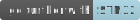

# __Example: *hal_tim_timebase*__

How to configure the TIM peripheral to generate a timebase in interrupt mode.

## __1. Detailed scenario__

__Initialization phase__: At the beginning of the `main()` function, the `mx_system_init()` function is called to initialize the peripherals, the flash interface, the system clock, and the SysTick.

The application executes the following __example steps__:

__Step 1__: Initializes the timer and the GPIO for the status LED.

Timer configuration:

- Sets the timer input and counter clocks.
- Sets the timer's autoreload register value to reach the selected time base frequency.
- Configures the timer in interrupt mode.

Sets up the GPIO pin for the status LED to blink according to the time base.

__Step 2__: Starts the timer counter in interrupt mode.

__Step 3__: The timer runs continuously and generates interrupt request in accordance with the selected time base frequency.
  The LED is toggled on each interrupt request.

__End of example__: If no error occurs, the timebase is generated indefinitely. The LED blinks forever.

## __2. Example configuration__

This example demonstrates the following peripheral:

__TIM__:

Set the timer prescaler to get the timer's counter clock running at 10kHz.
See the prescaler computation in the section [Hardware environment and setup](#3-hardware-environment-and-setup).

The timer's counter clock and the autoreload register are configured to generate an update event at the selected timebase frequency.

The timer interrupt request is enabled.

  
Timebase frequency configuration

__Principle__:

A timebase is generated thanks to the interrupt mode.
To do so, the timer generates update events continuously at the chosen timebase frequency.

__Counting mechanism__:

The timer counter generates an update event each time the counter exceeds the value of the autoreload register (ARR).
For instance, by setting this ARR to 99, the timer generates an update event every 100 timer clock cycles.

__Timer count frequency__:

The prescaler value (N) ranges from 0 to 65535, and the counter clock frequency (tim_cnt_ck) is divided by N + 1.

A counter counts from 0 to the ARR value, so (ARR + 1) clock cycles are counted.
Depending on the counter clock (tim_cnt_ck) value the timebase period and frequency are:

    timebase period = tim_cnt_ck period * (ARR + 1)
    timebase frequency = tim_cnt_ck frequency / (ARR + 1)

So, you can compute the ARR value to set to obtain the desired timebase frequency with this formula:

    ARR = (tim_cnt_ck frequency / timebase frequency) - 1

__Practical Applications of Numerical Computations__:

Numerical calculation of the ARR value to get a timebase frequency of 1Hz with the timer's counter clock set to 10kHz:

    ARR = (10 kHz / 1 Hz) - 1
    ARR = (10000 / 1) - 1
    ARR = 9999

__GPIO__:

This GPIO drives the status LED:

- The mode is set to output mode.
- The GPIO output type is set according to the hardware board.

## __3. Hardware environment and setup__

### __3.1. Generic Setup__

The timer configuration depends on the timer's input clock.
This clock is derived from the system clock tree.
So, the system clock configuration is a critical setup step.

### __3.2. Specific board setups__

This section focuses on the clock settings as this is critical to obtain the desired timebase.

  
On STM32U5 series.

  

  
Common configuration

  The AHB and APB clocks prescalers are set to 1:

  - The AHB clock (HCLK) is equal to the system clock (SYSCLK)

  - The timer's input clock (tim_ker_ck) is equal to its dedicated APB clock (PCLK).

    tim_ker_ck = PCLK = HCLK = SYSCLK (system clock)

  So: tim_ker_ck = HCLK in Hz

  To get the timer's counter clock frequency (tim_cnt_ck), the timer prescaler is computed as follows:

    timer_prescaler = (HCLK / tim_cnt_ck ) - 1

  Typical clock diagram for STM32U5xx MCU peripherals:

<!--
@startuml
@startditaa{doc/stm32u5xx_peripherals_clocks.png}
 +---------+
 | clock   |
 | source  |
 | control |
 +---+-----+
     |
    ++-\
  --+  |
    |  |
    |  |
  --+  |           +---------------+        +--------------+
    |  |  SYSCLCK  |  AHB          |  HCLK  |  APBx        |  PCLKx
    |  +-----------+  PRESC        +--------+  PRESC       +---+----------------------------
  --+  |           |  / 1,2,...512 |        | / 1,2,4,8,16 |   |      To APBx peripherals
    |  |           +---------------+        +--------------+   |
    |  |                                                       |   +----------+   tim_ker_ck
  --+  |                                                       +---+ x1 or x2 +-------------
    |  |                                                           +----------+  To TIMx
    +--/
@endditaa
@enduml
-->

Numerical values:

  - The HCLK is set to 160 MHz
  - The timer's counter clock is set to 10 kHz

        timer_prescaler = (160 MHz / 10 kHz) - 1 = 15999

  

  

    
On board NUCLEO-U575ZI-Q.

  Timer resources used:
   - TIM2

  | Board connector  and pin     | MCU pin | Signal name | ARDUINO  connector pin |
  | :---:                           | :---:   | :---:       | :---:                     |
  | CN12-19                         | PC7     | PC7 (LED)   | -                         |
  

  

## __4. Troubleshooting__

Find below the points of attention for this specific example.

- __System clock__: The timer clock depends on the system clock configuration. Changing the CPU clock or the peripheral bus' clock affects the timebase frequency.
- Depending on HAL_TICK_FREQ, the HAL tick counter represented by global HAL variable: uwTick (expressed in milliseconds) is not incremented by 1 but by the number of milliseconds that have elapsed between 2 HAL ticks.

## __5. See Also__

This [General-purpose timer cookbook for STM32 microcontrollers (ref. AN4776)](https://www.st.com/content/ccc/resource/technical/document/application_note/group0/91/01/84/3f/7c/67/41/3f/DM00236305/files/DM00236305.pdf/jcr:content/translations/en.DM00236305.pdf) provides a simple and clear description of the basic features and operating modes of the STM32 general-purpose timer peripherals.

This [STM32 cross-series timer overview (ref. AN4013)](https://www.st.com/content/ccc/resource/technical/document/application_note/54/0f/67/eb/47/34/45/40/DM00042534.pdf/files/DM00042534.pdf/jcr:content/translations/en.DM00042534.pdf) presents an overview of the timer peripherals for the STM32 product series.

This [General-purpose timer cookbook for STM32 microcontrollers (ref. AN4776)](https://www.st.com/content/ccc/resource/technical/document/application_note/group0/91/01/84/3f/7c/67/41/3f/DM00236305/files/DM00236305.pdf/jcr:content/translations/en.DM00236305.pdf) provides a simple and clear description of the basic features and operating modes of the STM32 general-purpose timer peripherals.

This [STM32 cross-series timer overview (ref. AN4013)](https://www.st.com/content/ccc/resource/technical/document/application_note/54/0f/67/eb/47/34/45/40/DM00042534.pdf/files/DM00042534.pdf/jcr:content/translations/en.DM00042534.pdf) presents an overview of the timer peripherals for the STM32 product series.

More information about the STM32Cube Drivers can be found in the drivers' user manual of the STM32 series you are using.

For instance for the STM32U5 series: [User Manual](https://www.st.com/resource/en/user_manual/dm00813340-.pdf).

More information about the STM32 ecosystem can be found in the [STM32 MCU Developer Zone](https://www.st.com/content/st_com/en/stm32-mcu-developer-zone.html).

## __6. License__

Copyright (c) 2025 STMicroelectronics.

This software is licensed under terms that can be found in the LICENSE file in the root directory
of this software component.
If no LICENSE file comes with this software, it is provided AS-IS.
