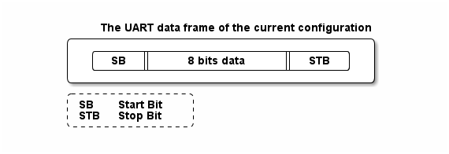
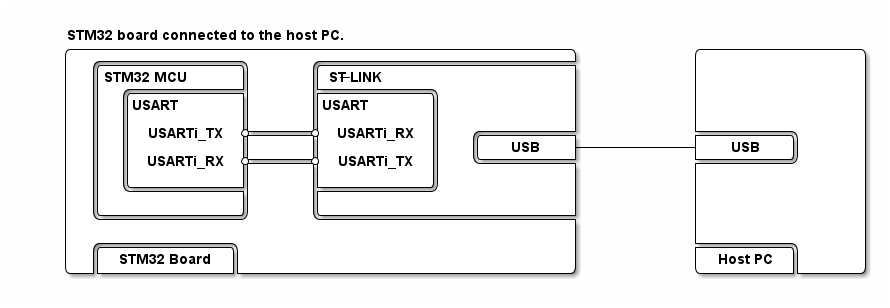

  

# __Example: *hal_uart_echo_it*__

How to implement UART communication in it mode, driven by HyperTerminal, using the HAL API.

## __1. Detailed scenario__

This example demonstrates the UART transmission (transmit/receive) in it mode between a board and an HyperTerminal PC application
The HAL UART transmission and reception APIs are used in interrupt mode to implement an __echo feature__ through a terminal emulator.

__Initialization phase__: At the beginning of the `main()` function, the `mx_system_init()` function is called to initialize the peripherals, the flash interface, the system clock, and the SysTick.

The application executes the following __example steps__:

__Step 1__: Configures and initializes the UART instance.

__Step 2__: Transmits a start message in interrupt mode to invite the user to enter data via the terminal.

__Step 3__: Waits for the transmission to complete or an error to occur.

__Step 4__: Starts the first reception in interrupt mode.

__Step 5__: Waits for the reception to complete or an error to occur.

__Step 6__: Starts reception on the next bufferthis approach makes sure data is received continuously, avoiding overrun errors .

__Step 7__: Echoes the received data on the terminal.

__Step 8__: Waits for the transmission to complete or an error to occur.

__End of example__: As long as no error occurs, the characters received are sent back to the user through the terminal emulator.

## __2. Example configuration__

The example demonstrates the following peripheral:

__UART__:

The UART is configured with the following settings:

- The baud rate is set to 115200.
- The word length is set to 8 bits.
- Stop bits are set to 1 bit.
- Parity is set to NONE.

<!--
@startuml
@startditaa{doc/ASCII_data_frame.png}

    The UART data frame of the current configuration:

      /--------------------------------------\
      |  /------+-----------------+-------\  |
      |  |  SB  |   8 bits data   |  STB  |  |
      |  \------+-----------------+-------/  |
      \--------------------------------------/

      /---------------\
      | SB:  Start Bit|
      | STB: Stop Bit |
      \=--------------/
@endditaa
@enduml
-->

The terminal emulator must be configured accordingly.

## __3. Hardware environment and setup__

### __3.1. Generic Setup__

This section describes the hardware setup principles that apply to any board.

Select the STM32 UART instance connected to the embedded ST-LINK on your board. The ST-LINK provides a virtual COM port over USB, which is mounted on the host PC and ready for use with a terminal emulator.

<!--
@startuml
@startditaa{doc/ASCII_Board_PC.png}

STM32 board connected to the host PC.

    /--------------------------------------------------\           /----------------\
    |  /--------------\      /-------------------------+           |                |
    |  |STM32 MCU     |      |ST-LINK                  |           |                |
    |  |  /-----------+      +-----------\             |           |                |
    |  |  |USART      |      |USART      |             |           |                |
    |  |  |           |      |           |             |           |                |
    |  |  | USARTi_TX *------* USARTi_RX |   /---------+           +---------\      |
    |  |  |           |      |           |   |   USB   +-----------+   USB   |      |
    |  |  | USARTi_RX *------* USARTi_TX |   \---------+           +---------/      |
    |  |  |           |      |           |             |           |                |
    |  |  \-----------+      +-----------/             |           |                |
    |  |              |      |                         |           |                |
    |  \--------------/      \-------------------------+           |                |
    |                                                  |           |                |
    |  /-------------\                                 |           +---------\      |
    |  | STM32 Board |                                 |           | Host PC |      |
    \--+-------------+---------------------------------/           \---------+------/
@endditaa
@enduml
-->

### __3.2. Specific board setups__

This section describes the exact hardware configurations of your project.

On STM32U5 series.

For the boards below, USART1 is connected to the STLINK-V3E.

  
On board NUCLEO-U575ZI-Q.

  | Board connector   | MCU pin | Signal name | ARDUINO   connector pin |
  | :---:             | :---:   | :---:       | :---:                      |
  | Not exposed       | PA10    | USART1_RX   |  ----                      |
  | Not exposed       | PA9     | USART1_TX   |  ----                      |
  | CN12-19           | PC7     | LED         | D13                        |

## __4. Troubleshooting__

Find below the points of attention for this specific example.

__Host PC settings__: Configure the terminal emulator to match the UART settings. Ensure the stop bits are correctly configured, considering whether they are included in the data length.

## __5. See Also__

You can also refer to these examples and utility to go further with the UART peripheral:

- hal_uart_two_boards_com_it_controller: the controller side in a interrupt mode UART communication between two boards.
- hal_uart_two_boards_com_it_responder: the responder side in a interrupt mode UART communication between two boards.
- basic_stdio utility: a basic trace service (`printf`-like) to report information from STM32 devices to a terminal.

More information about the STM32Cube Drivers can be found in the drivers' user manual of the STM32 series you are using.

For instance for the STM32U5 series: [User Manual](https://www.st.com/resource/en/user_manual/dm00813340-.pdf).

More information about the STM32 ecosystem can be found in the [STM32 MCU Developer Zone](https://www.st.com/content/st_com/en/stm32-mcu-developer-zone.html).

## __6. License__

Copyright (c) 2025 STMicroelectronics.

This software is licensed under terms that can be found in the LICENSE file in the root directory of this software component.
If no LICENSE file comes with this software, it is provided AS-IS.
