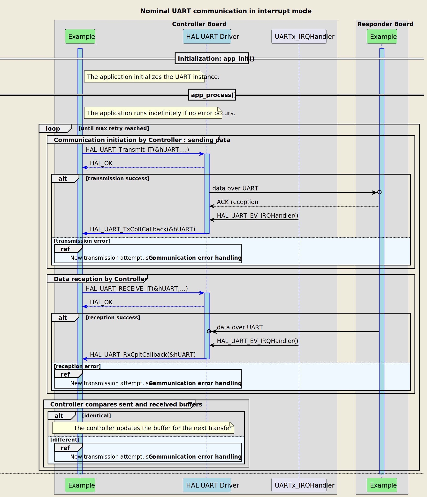

# __Example: *hal_uart_two_boards_com_it_controller*__

How to handle an infinite number of transmit-receive transactions between two boards based on the UART-bus protocol with the HAL API, in interrupt mode.

The example implements the controller's code.

## __1. Detailed scenario__

__Initialization phase__: At the beginning of the `main()` function, the `mx_system_init()` function is called to initialize the peripherals, the flash interface, the system clock, and the SysTick.

The application executes the following __example steps__:

__Step 1__: configures and initializes the UART instance.
            Registers the user callbacks for UART interrupts: TX/RX transfer completed and transfer error.

__Step 2__: The controller starts the communication, in interrupt mode, by sending a message to the responder. A counter of attempts is reset when initiating the communication loop.

__Step 3__: waits for one of these UART interrupts: write transfer complete or transfer error.

__Step 4__: The controller expects to receive the message back in interrupt mode.

__Step 5__: waits for one of these UART interrupts: read transfer complete or transfer error.

__Step 6__: The controller checks that the sent and received buffers match.
            Returns to step 2 indefinitely if no error occurs.

If the data transmit or receive operation fails or the exchanged buffers are different, the controller restarts the communication by sending again the same message. The `error_handler()` function is called when the maximum number of attempts is reached.

The communication status is reported via the status LED and the variable ExecStatus.

__End of example__: If no error occurs, the data is transferred infinitely between the controller and the responder. If the maximum number of attempts is reached, the data transfer is stopped and an error status is reported to the main function.

The following **message sequence chart** is used to describe the UART communication behavior between the controller board and the responder board.

 Expand this tab to visualize the sequence chart diagram in case of a data transmission error. 

## __2. Example configuration__

The example demonstrates the following peripheral:

__UART__:

We select a UART with accessible Tx and Rx signals on the board so that we can wire it to the responder board.

The UART is configured with the following settings:

- The baud rate is set to 115200.
- The word length is set to 8 bits.
- Stop bits are set to 1 bit.
- Parity is set to NONE.

<!--
@startuml
@startditaa{doc/ASCII_data_frame.png} -E -S

    The UART data frame of the current configuration:

      /--------------------------------------\
      |  /------+-----------------+-------\  |
      |  |  SB  |   8 bits data   |  STB  |  |
      |  \------+-----------------+-------/  |
      \--------------------------------------/

      /---------------\
      | SB:  Start Bit|
      | STB: Stop Bit |
      \=--------------/
@endditaa
@enduml
-->

## __3. Hardware environment and setup__

### __3.1. Generic Setup__

This section describes the hardware setup principles that apply to any board.

<!--
@startuml
@startditaa{doc/ASCII_uart_two_boards.png} -E -S
    /-------------------------\                     /-------------------------\
    |          /--------------+                     +--------------\          |
    |          | STM32 USARTi |                     | STM32 USARTi |          |
    |          |              |                     |              |          |
    |          |    USARTi_TX *---------------------* USARTi_RX    |          |
    |          |              |                     |              |          |
    |          |              |                     |              |          |
    |          |              |                     |              |          |
    |          |    USARTi_RX *---------------------* USARTi_TX    |          |
    |          |              |                     |              |          |
    |          \--------------+                     +--------------/          |
    |                         |                     |                         |
    |                     GND *---------------------* GND                     |
    |                         |                     |                         |
    |  /------------------\   |                     |  /-----------------\    |
    |  | STM32 Controller |   |                     |  | STM32 Responder |    |
    |  | Board            |   |                     |  | Board           |    |
    |  \------------------/   |                     |  \-----------------/    |
    \-------------------------/                     \-------------------------/
@endditaa
@enduml
-->

### __3.2. Specific board setups__

This section describes the exact hardware configurations of your project.

<!-- YOUR BOARDS ADDED HERE BY README GENERATION -->

On STM32U5 series.

  
On board B-U585I-IOT02A.

  | Board connector   | MCU pin | Signal name | ARDUINO Uno V3   connector pin |
  | :---:             | :---:   | :---:       | :---:                         |
  | CN14-1            | PD9     | USART3_RX   | ARDUINO CONNECTOR - D0        |
  | CN14-2            | PD8     | USART3_TX   | ARDUINO CONNECTOR - D1        |

> **_NOTE:_**
    - USART3 is the USART instance used for the communication between the DISCO boards because it is the only USART instance available on the ARDUINO connectors.
    - ARDUINO UART is shared with STMod+ CN2 UART so both cannot be used at the same time.
    - USART1 is connected by default to the STLINK-V3E debug interface.

  
On board NUCLEO-U545RE-Q.

  | Board connector   | MCU pin | Signal name |
  | :---:             | :---:   | :---:       |
  | CN7-2             | PC11    | USART3_RX   |
  | CN7-1             | PC10    | USART3_TX   |

> **_NOTE:_**
    - USART3 is the USART instance used for the communication between the Nucleo boards.
    - USART1 is connected by default to the STLINK-V3E debug interface.

  
On board NUCLEO-U575ZI-Q.

  | Board connector   | MCU pin | Signal name |     Zio   connector pin    |
  | :---:             | :---:   | :---:       | :---:                         |
  | CN9-4             | PD6     | USART2_RX   | Zio CONNECTOR - D52           |
  | CN9-6             | PD5     | USART2_TX   | Zio CONNECTOR - D53           |

> **_NOTE:_**
    - USART2 is the USART instance used for the communication between the Nucleo boards.
    - USART1 is connected by default to the STLINK-V3E debug interface.

## __4. Troubleshooting__

Find below the points of attention for this specific example.

__Communication Buffers__: Make sure that the size, in bytes, of the responder's reception buffer is equal to the size of the controller's transmission buffer.

## __5. See Also__

You can also refer to these examples to go further with the UART peripheral:

- hal_uart_two_boards_com_it_responder: The responder side in an interrupt mode UART communication driven by the controller.
- hal_uart_two_boards_com_polling_controller: The controller side in a polling mode UART communication.
- hal_uart_two_boards_com_polling_responder: The responder side in a polling mode UART communication driven by the controller.
- hal_uart_echo_polling: retargeting of the C library input and output functions to operate on the UART peripheral.

More information about the STM32Cube Drivers can be found in the drivers' user manual of the STM32 series you are using.

For instance for the STM32U5 series: [User Manual](https://www.st.com/resource/en/user_manual/dm00813340-.pdf).

More information about the STM32 ecosystem can be found in the [STM32 MCU Developer Zone](https://www.st.com/content/st_com/en/stm32-mcu-developer-zone.html).

## __6. License__

Copyright (c) 2025 STMicroelectronics.

This software is licensed under terms that can be found in the LICENSE file in the root directory
of this software component.
If no LICENSE file comes with this software, it is provided AS-IS.
