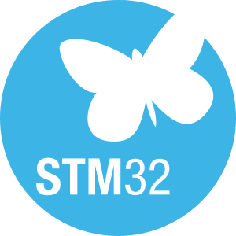
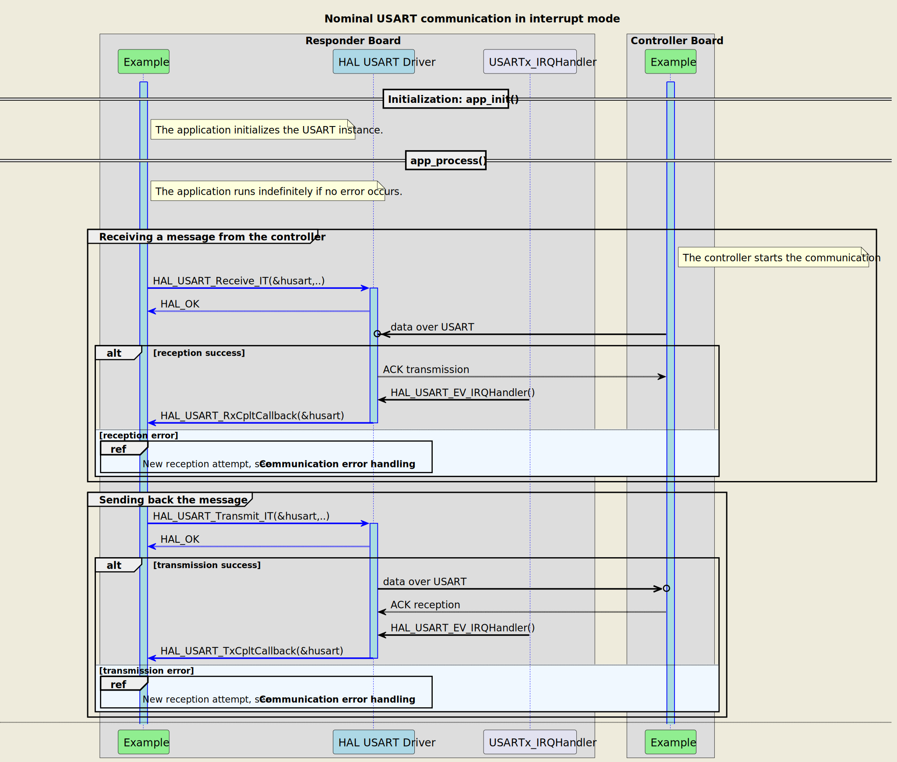
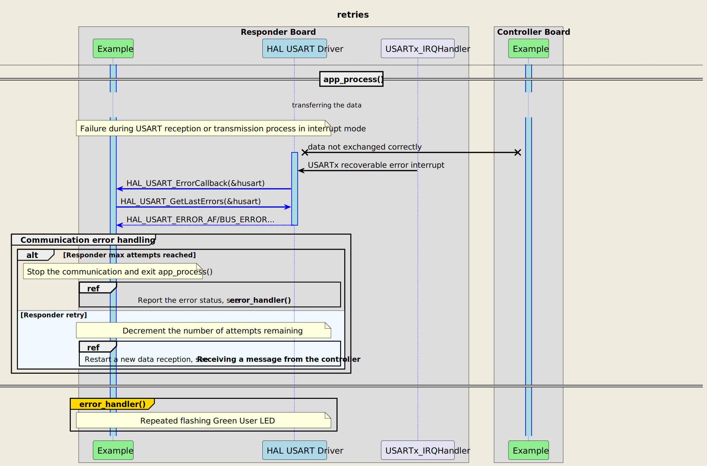
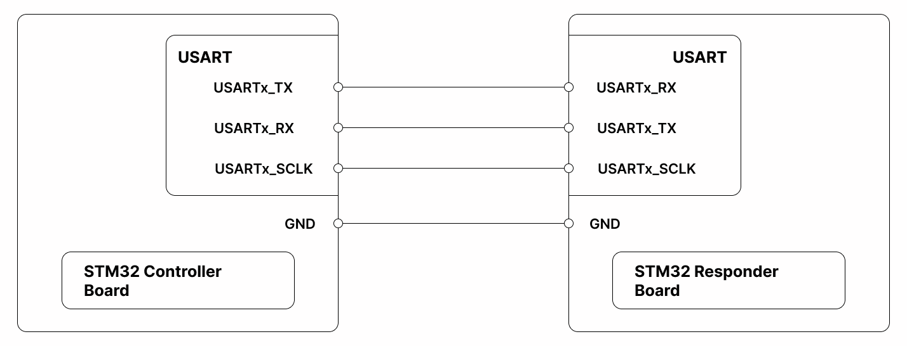

# __Example: *hal_usart_two_boards_com_it_responder*__

How to respond in an interrupt mode USART communication, driven by the controller, using the HAL API.
The scenario consists of an infinite number of receive-transmit transactions of changing messages.

## __1. Detailed scenario__

__Initialization phase__: At the beginning of the `main()` function, the `mx_system_init()` function is called to initialize the peripherals, the flash interface, the system clock, and the SysTick.

The application executes the following __example steps__:

__Step 1__: configures and initializes the USART instance and the NVIC.
            Registers the user callbacks for USART interrupts: TX/RX transfer completed and transfer error.

__Step 2__: The responder expects to receive a message as a null-terminated string from the controller board, in interrupt mode. A counter of attempts is reset when initiating the communication loop.

__Step 3__: waits for one of these USART interrupts: read transfer complete or transfer error.

__Step 4__: The responder sends back the received message in interrupt mode.

__Step 5__: waits for one of these USART interrupts: write transfer complete or transfer error.
            Returns to step 2 indefinitely if no error occurs.

The communication status is reported via the status LED and the variable ExecStatus.

__End of example__: If no error occurs, the data is transferred infinitely between the controller and the responder. If the maximum number of attempts is reached, the data transfer is stopped by reporting an error status.

The following **message sequence chart** is used to describe the USART communication behavior between the controller board and the responder board.

 Expand this tab to visualize the sequence chart diagram in case of a data transmission error. 

## __2. Example configuration__

The example demonstrates the following peripheral:

__USART__:

We select a USART with accessible TX, RX, and SCLK signals on the board so that we can wire it to the controller board.

The USART is configured with the following settings:

- The baud rate is set to 115200.
- The word length is set to 8 bits.
- Stop bits are set to 1 bit.
- Parity is set to NONE.
- Clock polarity is set to LOW.
- Clock phase is set to 1 EDGE.
- Clock last bit is ENABLED.
- Mode is set to SLAVE.

## __3. Hardware environment and setup__

### __3.1. Generic Setup__

This section describes the hardware setup principles that apply to any board.

<!--
@startuml
@startditaa{doc/ASCII_usart_two_boards.png} -E -S
    /-------------------------\                     /-------------------------\
    |          /--------------+                     +--------------\          |
    
    |          |    USARTi_TX *---------------------* USARTi_RX    |          |
    |          |              |                     |              |          |
    |          |              |                     |              |          |
    |          |              |                     |              |          |
    |          |    USARTi_RX *---------------------* USARTi_TX    |          |
    |          |              |                     |              |          |
    |          |              |                     |              |          |
    |          |              |                     |              |          |
    |          |  USARTi_SCLK *---------------------* USARTi_SCLK  |          |
    |          |              |                     |              |          |
    |          \--------------+                     +--------------/          |
    |                         |                     |                         |
    |                     GND *---------------------* GND                     |
    |                         |                     |                         |
    |  /------------------\   |                     |  /-----------------\    |
    |  | STM32 Controller |   |                     |  | STM32 Responder |    |
    |  | Board            |   |                     |  | Board           |    |
    |  \------------------/   |                     |  \-----------------/    |
    \-------------------------/                     \-------------------------/
@endditaa
@enduml
-->

### __3.2. Specific board setups__

This section describes the exact hardware configurations of your project.

<!-- YOUR BOARDS ADDED HERE BY README GENERATION -->

On STM32U5 series.

  
On board NUCLEO-U575ZI-Q.

  | Board connector   | MCU pin | Signal name |     Arduino   connector pin    |
  | :---:             | :---:   | :---:       | :---:       |
  | CN9-2             | PD7     | USART2_SCLK | -           |
  | CN9-4             | PD6     | USART2_RX   | -           |
  | CN9-6             | PD5     | USART2_TX   | -           |

  

## __4. Troubleshooting__

Find below the points of attention for this specific example.

__Communication Buffers__:  Make sure that the size, in bytes, of the responder's reception buffer is equal to the size of the controller's transmission buffer.

## __5. See Also__

More information about the STM32Cube Drivers can be found in the drivers' user manual of the STM32 series you are using.

For instance for the STM32U5 series: [User Manual](https://www.st.com/resource/en/user_manual/dm00813340-.pdf).

More information about the STM32 ecosystem can be found in the [STM32 MCU Developer Zone](https://www.st.com/content/st_com/en/stm32-mcu-developer-zone.html).

## __6. License__

Copyright (c) 2025 STMicroelectronics.

This software is licensed under terms that can be found in the LICENSE file in the root directory
of this software component.
If no LICENSE file comes with this software, it is provided AS-IS.
