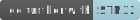

# __Example: *led_blinking_gpio*__

How to use the LED part GPIO API.
It illustrates it by blinking the status LED through a GPIO.

## __1. Detailed scenario__

This scenario demonstrates how to drive an LED connected to a GPIO with the LED part API.

__Initialization phase__: At the beginning of the `main()` function,
the `mx_system_init()` function is called to initialize the peripherals, the flash interface, the system clock,
and the SysTick.

The application executes the following __example steps__:

__Step 1__: Initializes the LED using the function ``led_init``

__Step 2__: Turns on, then off, the MX_STATUS_LED using the ``led_on`` and ``led_off`` LED part functions

__Step 3__: Toggles twice the MX_STATUS_LED using the ``led_toggle`` LED part function

__End of example__: The steps 2 and 3 are repeated infinitely.

## __2. Example configuration__

In accordance with the selected GPIO input pin, the following peripherals must be configured:

- *GPIO*:
  - The pin must be configured as an output in push-pull mode.

## __3. Hardware environment and setup__

### __3.1. Generic Setup__

This section describes the hardware setup principles that apply to any board.

### __3.2. Specific board setups__

On STM32U5 series.

  
On board B-U585I-IOT02A.

  | Board pin  | MCU pin | Signal name     | ARDUINO   connector pin |
  | :---:      | :---:   | :---:           | :---:                      |
  | CN13-6     | PE13    | MX_STATUS_PIN   | D13                        |

  
On board NUCLEO-U575ZI-Q.

  | Board pin   | MCU pin | Signal name     | ARDUINO   connector pin |
  | :---:       | :---:   | :---:           | :---:                      |
  | CN12-19     | PC7     | MX_STATUS_PIN   | -                          |

## __4. Troubleshooting__

No specific debug tips.

## __5. See Also__

You can also refer to these other examples:

- HAL_GPIO_Toggle to toggle any GPIO with HAL API (the GPIO can be connected to an LED)

More information about the STM32Cube drivers can be found in the drivers' user manual of the STM32 series you are using.

For instance for the STM32U5 series: [User Manual](https://www.st.com/resource/en/user_manual/dm00813340-.pdf).

More information about the STM32 ecosystem can be found in the [STM32 MCU Developer Zone](https://www.st.com/content/st_com/en/stm32-mcu-developer-zone.html).

## __6. License__

Copyright (c) 2025 STMicroelectronics.

This software is licensed under terms that can be found in the LICENSE file in the root directory
of this software component.
If no LICENSE file comes with this software, it is provided AS-IS.
