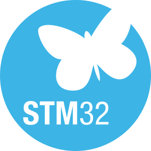

# __Example: *sequencer_gpio_toggle*__

This example demonstrates a application to handle a GPIO toggle on an STM32 microcontroller using the sequencer utility. The main loop acts as an infinite loop for the sequencer execution, and SysTick is used to trigger a task responsible for toggling the GPIO every 1 second.

## __1. Detailed scenario__

__Initialization phase__: At the beginning of the main program, the `mx_system_init()` function is called to initialize the peripherals, the flash interface, the system clock and the SysTick.
In the `app_init()` function, `mx_seq_init()` is called to initialize the sequencer.

The application executes the following __example steps__:

__Step 1__: Configures the sequencer utility (priority and number of tasks, task name and task function name)

__Step 2__: Configures a  GPIO pin in output mode (typically a pin connected to a LED)

__Step 3__: Create a function task to toggle the LED connected to a GPIO PIN.

__Step 4__: infinite loop  of this sequencer: call `SEQ_Run()`, a task will be set every 1 second thanks to `HAL_CORTEX_SYSTICK_Callback()`.

__End of example__: The example never finishes, and the GPIO toggles indefinitely every 1 second. The variable 'ToggleCounter' can be monitored to follow the calls of the gpio_toggle() task.

## __2. Example configuration__

__Sequencer__: The sequencer is configured with these specific parameters:

  - _priority_: __2__

  - _number of task_: __1__

  - _task name_: __toggle__

  - _task function name_: __gpio_toggle__

  __GPIO__: The GPIO pin is configured in  output mode :

  - _label_: __MX_EXAMPLE_GPIO__

## __3. Hardware environment and setup__

### __3.1. Generic Setup__

<!--
@startuml
@startditaa{doc/generic_hardware_setup.png}
    +-------------------------------------------------------------------------+
    |          /----------------------\                                       |
    |          |STM32                 |                                       |
    |          |                      |                  /-----\              |
    |          | MX_EXAMPLE_GPIO_PIN  *------------------* LED |              |
    |          |                      |                  \-----/              |
    |          |                      |                                       |
    |          |                      |                                       |
    |          \----------------------/                                       |
    | STM32_Board                                                             |
    +-------------------------------------------------------------------------+
@endditaa
@enduml
-->

### __3.2. Specific board setups__

This section describes the exact hardware configurations of your project.

On STM32U5 series.

  
On board NUCLEO-U575ZI-Q.

  | Board connector   | MCU pin | Signal name           | ARDUINO   connector pin |
  | :---:             | :---:   | :---:                 | :---:                      |
  | CN12-19           | PC7     | User green LED (LD1)  | -                          |

## __4. Troubleshooting__

Find below the points of attention for this specific example.

__Topic A__: Make sure that the switch "SEQ_USER_CONFIG" necessary to load sequencer user configuration is present on toolchain preprocessor define.

__Topic B__: make sure that GPIO pin is properly configured and clocked.

## __5. See Also__

This [application note](https://www.st.com/resource/en/application_note/an5701-stm32cube-mcu-package-examples-for-stm32u5-series-stmicroelectronics.pdf)
explains further this XXX feature.

You can also refer to these other examples to go further with sequencer:

- sequencer_gpio_toggle_lowpower: demonstrates the use of sequencer to manage tasks and switching to lowpower mode.

The user manual of the drivers of the relevant STM32 series contains more detailed information.

the user manual of the sequencer utility contains more detailed information about using the sequencer.

More information about the STM32 ecosystem can be found in the [STM32 MCU Developer Zone](https://www.st.com/content/st_com/en/stm32-mcu-developer-zone.html).

## __6. License__

Copyright (c) 2025 STMicroelectronics.

This software is licensed under terms that can be found in the LICENSE file in the root directory
of this software component.
If no LICENSE file comes with this software, it is provided AS-IS.
