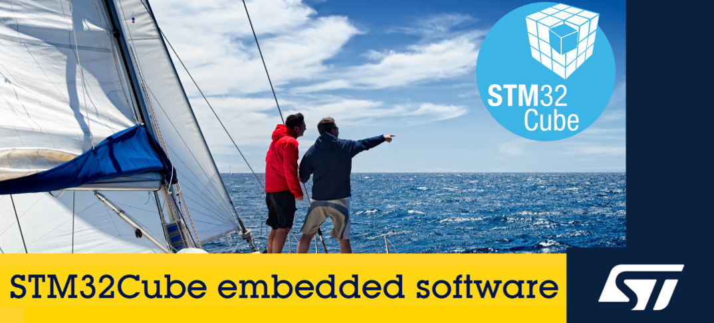

# STM32CubeU5 HAL2 Drivers

For the upcoming STM32Cube HAL drivers to HAL2 the following improvements are targeted:

- **Increase portability from one STM32 to another**
- **Improve performance and footprint**
- **Enhanced intuitiveness and usability**
- **Add more service granularity**
- **Enhance integration with RTOSes**
- **Reinforce readability and conformity to C standards**

To achieve these goals, the STM32Cube HAL2 drivers will introduce several key changes and improvements.
Some of the key changes introduced include:

- Split the initialization API into two: one for initialization and one for configuration, achieving better performance and footprint while improving usability.
- Split heavy processes like clock management for all sources and IRQ handling for all modes to improve ease of use and performance by avoiding covering all use cases in a single API.
- Reinforce portability by introducing a default initialization that is fully portable across all series.
- Addition of atomic configuration methods to provide greater granularity when dynamically setting up peripherals, complementing the global configuration.
- HAL services call exclusively the LL drivers instead of accessing registers directly. This approach helps optimize code by transitioning from HAL to LL and also improves quality by reducing maintenance requirements.
- Enhance the lock, state and error management within drivers to reinforce thread safety and prevent race condition in some functional cases.
- Provide more control services to reinforce portability especially regarding clock control and filter processes interrupts.
- Apply new coding rules and naming convention, to improve conformity with C standards.

More information about the STM32Cube HAL2 drivers can be found in the documentation [STM32 HAL/LL Drivers Documentation](https://dev.st.com/stm32cube-docs/stm32u5-hal2/2.0.0-beta.1.1/), which is an early version of the new documentation.

To illustrate the footprint improvements the HAL2 brings to the U5 HAL drivers, examples based on typical peripheral scenarios using either HAL or HAL2 have been compared in terms of footprint reduction:

| Peripheral | Example                      | Reduction in bytes | Reduction in % |
| ---------- | ---------------------------- | ------------------ | -------------- |
| GPIO       | IO Toggle                    | 1980               | 32%            |
| I2C        | Two Boards COM IT Controller | 5104               | 43%            |
| TIM        | PWM Output                   | 3187               | 35%            |
| RCC        | Clock Config                 | 1970               | 31%            |

Achieving these improvements, the STM32Cube HAL2 drivers are expected to significantly enhance the development experience for STM32 microcontroller users, but also comes with the cost of breaking the API compatibility with the current STM32Cube HAL drivers.

The documentation [Breaking changes in concepts](../docs/breaking_concepts/breaking_concepts_toc.rst) highlights the key changes and their benefits. 
The **Breaking changes in concepts** documentation is part of a comprehensive migration guide that will be available at final release, designed to simplify the transition from the current STM32Cube HAL drivers to the STM32Cube HAL2.
